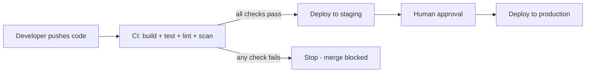

# Learn CI/CD with GitHub Actions

> **Module 5 of the DevOps Masterclass.** By now you can version code (Git), provision infrastructure (Terraform), package an app (Docker), and run it at scale (Kubernetes). CI/CD is the glue that ties it all together: it automatically builds, tests, and ships your code every time you push.

## What problem does CI/CD solve?

Doing builds, tests, and deployments by hand is slow and error-prone. Someone forgets a step, tests get skipped under deadline pressure, and a bad change reaches users. CI/CD removes the manual work: every push runs the same checks automatically, and only code that passes every gate is allowed to ship.

A useful way to picture it: a CI/CD pipeline is a factory assembly line with quality inspectors at each station. Your code is the raw material. Each station (build, test, lint, security scan) inspects it. If any inspector finds a defect, the line stops and the product never reaches the customer. Only goods that pass every check get shipped, and a human supervisor signs off before the final delivery to production.

## Interactive demo

Open [animations/cicd-pipeline.html](animations/cicd-pipeline.html) in any browser. Push a good commit and watch it flow to production; push a buggy commit and watch CI stop it before it ships.

## Hands-on demo project

The [`demo/`](demo/) folder is a complete, runnable project - a small Python Flask app with tests, a Dockerfile, Kubernetes manifests, and ready-to-use GitHub Actions workflows. Use it to show students a real pipeline end to end: push code, watch CI test it, build and push an image, and deploy to Kubernetes. See [demo/README.md](demo/README.md) for a step-by-step walkthrough and a suggested 30-minute class demo flow.

## Course structure

This module uses GitHub Actions, GitHub's built-in CI/CD platform. It is free for public repositories and needs no extra tools beyond a GitHub account.

| Day | Topic | What you will learn |
|---|---|---|
| [Day 1](day1-foundations/notes.md) | **CI/CD Foundations** | What CI, CD, and pipelines are; workflows, jobs, steps, runners, triggers; your first workflow |
| [Day 2](day2-continuous-integration/notes.md) | **Continuous Integration** | Running tests, linting, matrix builds, caching, artifacts, branch protection |
| [Day 3](day3-secrets-environments/notes.md) | **Secrets & Environments** | GitHub Secrets, environments, approval gates, OIDC keyless auth, least privilege |
| [Day 4](day4-continuous-deployment/notes.md) | **Continuous Deployment** | Building and pushing Docker images, deploying to cloud platforms, versioning, rollbacks, smoke tests |
| [Day 5](day5-end-to-end-project/notes.md) | **End-to-End Project** | Tie Git, Terraform, Docker, Kubernetes and CI/CD into one complete pipeline |

## Prerequisites

- A GitHub account
- Comfort with Git basics (see the [Git module](../learn-git))
- Helpful but not required: the [Docker module](../learn-docker), since Continuous Deployment builds and ships container images

## Learning outcomes

By the end of this module you will be able to:

- Explain CI, Continuous Delivery, and Continuous Deployment, and how they differ
- Write GitHub Actions workflows that build and test code on every push and pull request
- Run tests across multiple versions in parallel, cache dependencies, and share build artifacts
- Store secrets safely and require human approval before production deployments
- Build and publish Docker images and deploy them to a cloud platform
- Roll back a bad release quickly and verify deployments with smoke tests

## How to use this module

1. Work through the five lessons in order; each builds on the previous one.
2. Create a throwaway GitHub repository and actually run the workflows. Watching a pipeline run live in the Actions tab teaches more than reading about it.
3. Try the labs at the end of each lesson, then attempt the challenges.

Start with [Day 1: CI/CD Foundations](day1-foundations/notes.md). When you finish, return to the [main DevOps course](../README.md).
