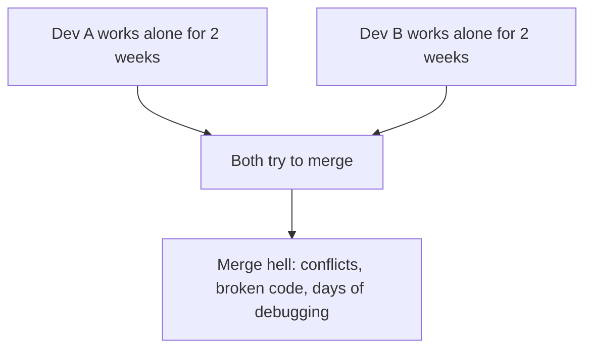
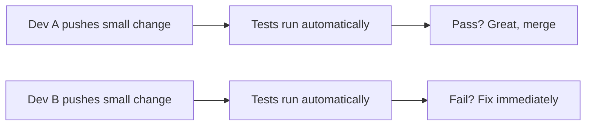
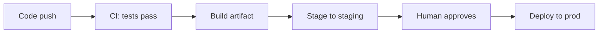
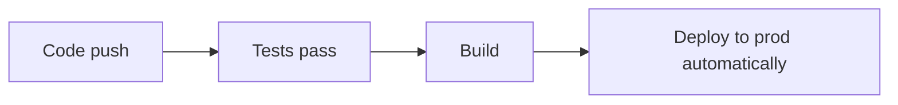
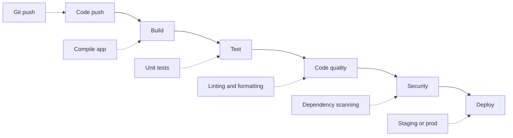
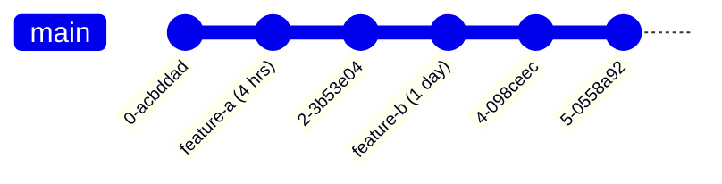
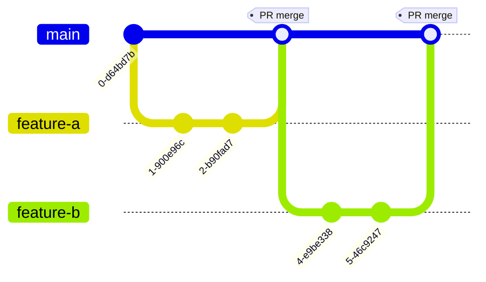
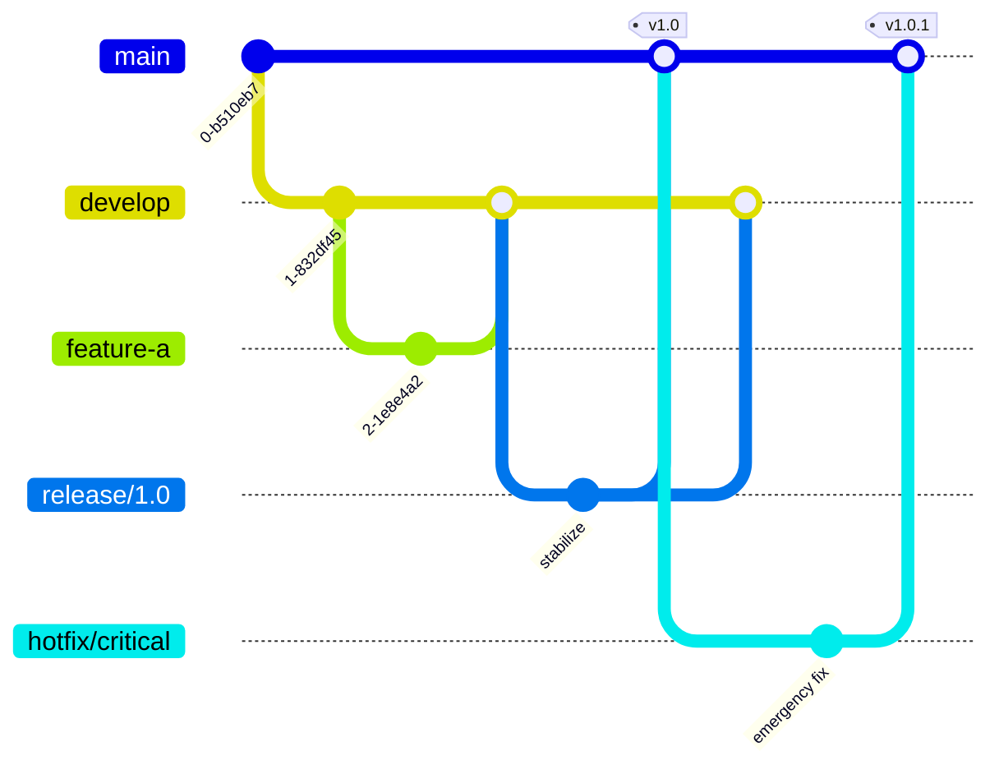
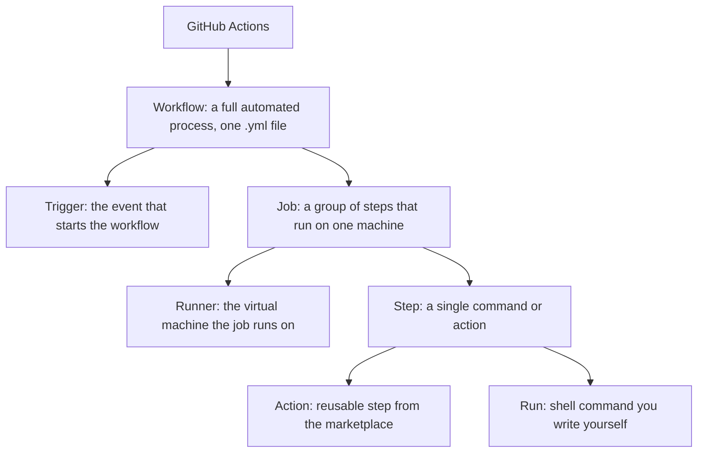

# Day 1 - CI/CD Foundations

> Goal: Build a clear mental model of what CI/CD is, why it exists, and the GitHub Actions vocabulary you need before writing your first pipeline.

## Learning Objectives

By the end of this module, you will be able to:

- Explain in plain language what CI, Continuous Delivery, and Continuous Deployment each mean
- Describe the problem CI/CD was invented to solve
- Compare the main Git branching strategies and how they affect when a pipeline runs
- Identify the core GitHub Actions building blocks: workflow, job, step, runner, action, trigger
- Read a workflow file line by line and explain what each part does
- Write and run your first Hello World workflow
- Avoid the most common beginner misunderstandings about CI/CD

## Table of Contents

1. [What is CI/CD?](#1-what-is-cicd)
2. [Why CI/CD Matters](#2-why-cicd-matters)
3. [Git Branching Strategies](#3-git-branching-strategies)
4. [GitHub Actions - Core Concepts](#4-github-actions---core-concepts)
5. [Anatomy of a Workflow File](#5-anatomy-of-a-workflow-file)
6. [Your First Workflow](#6-your-first-workflow)
7. [Triggers (Events)](#7-triggers-events)
8. [Lab - Hello World Pipeline](#lab---hello-world-pipeline)

---

## 1. What is CI/CD?

### Continuous Integration (CI)

**Definition:** The practice of automatically integrating code changes from multiple contributors into a shared repository frequently (multiple times per day), and automatically running tests and checks on every change.

**The core idea:**
Instead of developers working in isolation for weeks and merging a massive change at the end (called "big bang integration"), CI encourages small, frequent merges. Every time code is pushed, an automated system builds the project and runs tests immediately.

**A real-world analogy:** Continuous Integration is like a restaurant kitchen where every dish is taste-tested the moment it is plated. A bad dish never leaves the kitchen, so the customer never sees it. Compare that to a kitchen that cooks for a week and only tastes everything on the night of the big banquet - by then it is far too late to fix a spoiled sauce. CI tastes early and often so problems are caught while they are still small.

**Without CI (the old way):**



**With CI:**



**What CI does automatically:**
- Compiles/builds the code
- Runs unit tests
- Runs integration tests
- Checks code style/formatting (linting)
- Checks for security vulnerabilities
- Measures code coverage
- Reports back with pass/fail

---

### Continuous Delivery (CD)

**Definition:** An extension of CI where code that passes all automated tests is automatically prepared and made ready for release to production at any time. A human still clicks the final deploy button.

**Key distinction:** The software is *always in a deployable state*. You *can* deploy at any time, but you choose *when*.

Think of Continuous Delivery as having every approved dish boxed up and sitting on the pass, ready to go the instant a waiter calls for it. The food is finished and safe to serve; a human just decides the moment it leaves the kitchen.



---

### Continuous Deployment (also CD)

**Definition:** Goes one step further than Continuous Delivery - every change that passes all automated tests is *automatically* deployed to production without human intervention.

**Key distinction:** No human approval step. If tests pass, it ships.

Continuous Deployment is the dish being carried straight to the customer automatically the moment it passes the taste test, with nobody standing at the pass to wave it through. This only works when you trust your taste-testing (your automated tests) completely.



**When to use which:**
| Approach | Best for |
|---|---|
| CI only | Small teams just starting out |
| Continuous Delivery | Most teams - human has final say on prod |
| Continuous Deployment | High-confidence test suites, web apps, SaaS products |

---

### The CI/CD Pipeline

A **pipeline** is the series of automated steps that code goes through from commit to production. Picture a factory assembly line or a car wash conveyor: your code enters at one end and moves through one station after another, and it only comes out the far end if every station was happy with it.



---

## 2. Why CI/CD Matters

### The Business Case

**Without CI/CD:**
- Bugs found late (weeks after code was written) - expensive to fix
- Manual deployments - slow, error-prone, stressful "deploy Fridays"
- "Works on my machine" - different environments cause mysterious failures
- Fear of deploying - so teams deploy less often, creating bigger, riskier releases

**With CI/CD:**
- Bugs caught immediately - while the developer still remembers the code
- Deployments are automated and repeatable - deploy 10 times a day confidently
- Consistent environments - same process every time
- Small, safe releases - less risk, faster recovery if something breaks

### Real-World Stats

- Teams using CI/CD deploy **200x more frequently** than those without
- **24x faster** recovery from failures
- **3x lower** change failure rate
- Developer productivity increases because less time is wasted on manual tasks

### The Developer Experience

**Before CI/CD:**
1. Write code for a week
2. "I think it works, let me push"
3. Break production
4. Spend 3 hours at 11pm rolling back and fixing

**After CI/CD:**
1. Write a small change
2. Push - tests run automatically in 2 minutes
3. "Tests passed, great" - merge with confidence
4. Deployment happens automatically, verified, monitored

---

## 3. Git Branching Strategies

Understanding branching strategies is critical because CI/CD pipelines are triggered by specific branch events. The strategy you choose affects *when* and *how* your pipeline runs.

### Strategy 1 - Trunk-Based Development

**The idea:** Everyone commits directly to `main` (the "trunk") multiple times per day. Short-lived feature branches (max 1-2 days) are allowed but kept very small.



**CI/CD implication:** Tests run on every push to `main`. Because commits are small and frequent, problems are caught fast.

**Best for:** Experienced teams, high test coverage, feature flags for hiding incomplete features.

---

### Strategy 2 - GitHub Flow

**The most common for small/medium teams.**



Tests run on each pull request before the merge happens.

**The workflow:**
1. Create a feature branch from `main`
2. Make commits, push to GitHub
3. Open a Pull Request
4. **CI runs automatically on the PR** - tests, lint, etc.
5. Team reviews the code
6. Merge only when CI passes + reviews approved
7. CD deploys automatically from `main`

**CI/CD implication:**
- CI runs on every PR and every push to feature branches
- CD deploys on every merge to `main`

---

### Strategy 3 - GitFlow

**More structured, suited for versioned software (apps with releases, libraries).**



**Branches:**
| Branch | Purpose |
|---|---|
| `main` | Production-ready code, tagged releases |
| `develop` | Latest development changes |
| `feature/*` | New features (branch from develop) |
| `release/*` | Release preparation, bug fixes only |
| `hotfix/*` | Emergency production fixes |

**CI/CD implication:**
- CI runs on all branches
- CD to staging deploys from `develop`
- CD to production deploys from `main` (on tag push)

---

### Which to Choose?

For this course, we use **GitFlow** - it introduces the full set of branch types (feature, develop, release, hotfix, main) that you'll encounter in real teams, and it maps cleanly onto the environments (dev to staging to production) we'll build throughout the bootcamp.

---

## 4. GitHub Actions - Core Concepts

GitHub Actions is GitHub's built-in CI/CD platform. It is:
- Free for public repositories
- 2,000 minutes/month free for private repos on the free plan
- Runs in cloud-hosted virtual machines (called **runners**)
- Configured entirely through YAML files in your repository

### The Hierarchy



---

### Workflows

A **workflow** is an automated process defined in a `.yml` file inside `.github/workflows/`.

- One repo can have **many workflow files**
- Each file = one workflow
- Workflows run independently of each other
- Examples: `ci.yml`, `deploy.yml`, `release.yml`, `nightly-tests.yml`

```
.github/
└── workflows/
    ├── ci.yml           ← runs on every PR
    ├── deploy.yml       ← runs on merge to main
    └── nightly.yml      ← runs on schedule every night
```

---

### Jobs

A **job** is a set of steps that execute on the same runner (virtual machine).

**Key properties:**
- Jobs run **in parallel by default**
- Jobs can be made to run sequentially using `needs:`
- If one job fails, dependent jobs are skipped (by default)
- Each job gets a **fresh, clean virtual machine** - no state is shared between jobs unless you explicitly pass artifacts

```yaml
jobs:
  test:           # ← job ID (you choose the name)
    runs-on: ubuntu-latest
    steps: [...]

  build:          # ← runs in parallel with "test" by default
    runs-on: ubuntu-latest
    steps: [...]

  deploy:
    needs: [test, build]   # ← runs only after both test AND build pass
    runs-on: ubuntu-latest
    steps: [...]
```

---

### Steps

A **step** is a single task within a job. Steps run **sequentially** - one after another, on the same machine.

A step is either:
1. A **`run`** step - you write a shell command
2. A **`uses`** step - you use a pre-built Action from the marketplace

```yaml
steps:
  - name: Checkout code          # ← step name (optional but helpful)
    uses: actions/checkout@v4    # ← uses a pre-built action

  - name: Install dependencies
    run: npm install             # ← runs a shell command

  - name: Run tests
    run: npm test
```

---

### Runners

A **runner** is the virtual machine that executes a job.

A runner is like a rented temporary kitchen that is cleaned out completely after each job. GitHub hands you a spotless kitchen, you cook your meal (build and test your code) in it, and the moment the job ends the kitchen is torn down and wiped clean. The next job gets a brand new kitchen. This is why nothing you create in one job survives into the next unless you deliberately pack it into an artifact and carry it over.

**GitHub-hosted runners (free):**
| Label | OS |
|---|---|
| `ubuntu-latest` | Ubuntu Linux (most common, fastest) |
| `windows-latest` | Windows Server |
| `macos-latest` | macOS |

```yaml
jobs:
  test:
    runs-on: ubuntu-latest   # ← specify the runner here
```

**What's installed on Ubuntu runners:**
- Node.js, Python, Ruby, Go, Java, .NET
- Docker, git, curl, wget
- Most common CLI tools
- See full list: https://github.com/actions/runner-images

**Self-hosted runners:** when you need something GitHub's machines do not offer - a specific GPU, a box inside your private network, or a large warm cache - you can register **your own** machine with `runs-on: self-hosted`. You then maintain and secure it, and (unlike hosted runners) it is **not** wiped between jobs, so treat it carefully. Rule of thumb: use GitHub-hosted runners unless you have a concrete reason not to.

```yaml
jobs:
  build:
    runs-on: [self-hosted, gpu]   # your machine, matched by its labels
```

**Always give a job a timeout** so a hung step cannot run for hours and burn your minutes:

```yaml
jobs:
  test:
    runs-on: ubuntu-latest
    timeout-minutes: 15           # kill the job if it exceeds 15 minutes
```

**Prevent overlapping runs** of the same workflow/branch with `concurrency` - essential for deploys, so two runs never fight over one environment:

```yaml
concurrency:
  group: ${{ github.workflow }}-${{ github.ref }}
  cancel-in-progress: true        # cancel an older in-progress run (use false for deploys)
```

---

### Actions

An **action** is a reusable unit of code that can be used as a step. Think of actions like npm packages - someone wrote the complex logic, you just plug it in.

**Actions come from:**
1. The official GitHub Actions org (`actions/checkout`, `actions/setup-node`)
2. The GitHub Marketplace (thousands of community actions)
3. Your own repo (custom actions you write)

```yaml
# Using actions with version pinning (always pin versions!)
- uses: actions/checkout@v4           # official - checks out your code
- uses: actions/setup-node@v4         # official - installs Node.js
  with:
    node-version: '20'
- uses: actions/upload-artifact@v4    # official - saves build output
```

**Why pin versions?** If you use `actions/checkout@main`, the action could change and break your pipeline without warning. `@v4` is stable.

---

## 5. Anatomy of a Workflow File

Let's dissect a complete workflow file line by line:

```yaml
# .github/workflows/ci.yml

# ─────────────────────────────────────────
# WORKFLOW NAME
# ─────────────────────────────────────────
name: CI Pipeline
# Optional but recommended. Shows up in the GitHub Actions UI.

# ─────────────────────────────────────────
# TRIGGERS
# ─────────────────────────────────────────
on:
  push:
    branches: [main, develop, 'release/**', 'hotfix/**']   # GitFlow branches
  pull_request:
    branches: [develop, main]   # PRs target develop (features) or main (hotfixes/releases)

# ─────────────────────────────────────────
# ENVIRONMENT VARIABLES (workflow-level)
# ─────────────────────────────────────────
env:
  NODE_VERSION: '20'
  # Available to ALL jobs and steps in this workflow

# ─────────────────────────────────────────
# JOBS
# ─────────────────────────────────────────
jobs:

  # ── JOB 1 ──────────────────────────────
  test:
    name: Run Tests              # display name in UI
    runs-on: ubuntu-latest       # runner OS

    # Job-level env vars (override workflow-level if same name)
    env:
      DATABASE_URL: postgres://localhost/testdb

    # Steps run sequentially on this runner
    steps:

      # Step 1: Get the code onto the runner
      - name: Checkout repository
        uses: actions/checkout@v4

      # Step 2: Set up the runtime
      - name: Set up Node.js
        uses: actions/setup-node@v4
        with:
          node-version: ${{ env.NODE_VERSION }}   # reference env var
          cache: 'npm'                             # cache node_modules

      # Step 3: Install dependencies
      - name: Install dependencies
        run: npm ci     # 'npm ci' is faster and stricter than 'npm install'

      # Step 4: Run tests
      - name: Run test suite
        run: npm test

      # Step 5: Only runs if previous steps passed
      - name: Upload coverage report
        uses: actions/upload-artifact@v4
        with:
          name: coverage-report
          path: coverage/

  # ── JOB 2 ──────────────────────────────
  lint:
    name: Lint Code
    runs-on: ubuntu-latest
    # No 'needs' = runs in PARALLEL with 'test' job

    steps:
      - uses: actions/checkout@v4
      - uses: actions/setup-node@v4
        with:
          node-version: ${{ env.NODE_VERSION }}
      - run: npm ci
      - run: npm run lint

  # ── JOB 3 ──────────────────────────────
  deploy:
    name: Deploy to Staging
    runs-on: ubuntu-latest
    needs: [test, lint]          # only runs if BOTH test AND lint pass

    # Conditional: only deploy when pushing to main, not on PRs
    if: github.ref == 'refs/heads/main'

    steps:
      - uses: actions/checkout@v4
      - name: Deploy
        run: ./deploy.sh
        env:
          DEPLOY_KEY: ${{ secrets.DEPLOY_KEY }}   # use a secret
```

---

### YAML Key Points for Workflows

**Indentation matters!** YAML uses spaces (not tabs). Two spaces per level is standard.

```yaml
# CORRECT
jobs:
  test:
    runs-on: ubuntu-latest
    steps:
      - name: Hello
        run: echo "Hello"

# WRONG - inconsistent indentation will cause errors
jobs:
    test:
      runs-on: ubuntu-latest
```

**Multi-line run commands:**
```yaml
# Single line
- run: npm test

# Multiple commands (use pipe |)
- run: |
    echo "Starting tests"
    npm ci
    npm test
    echo "Tests complete"
```

**Expressions and contexts:**
```yaml
# ${{ }} is used for expressions
- run: echo "Branch is ${{ github.ref }}"
- run: echo "Actor is ${{ github.actor }}"
- run: echo "Event is ${{ github.event_name }}"
```

---

## 6. Your First Workflow

Let's build the simplest possible workflow to understand the mechanics.

### Setup

1. Create a GitHub repository (or use this one)
2. Create the directory structure:

```bash
mkdir -p .github/workflows
```

3. Create this file:

```yaml
# .github/workflows/hello.yml
name: Hello World

on:
  push:                # trigger on every push to any branch
  workflow_dispatch:   # also allow manual trigger from GitHub UI

jobs:
  greet:
    runs-on: ubuntu-latest

    steps:
      - name: Print greeting
        run: echo "Hello, GitHub Actions!"

      - name: Show runner info
        run: |
          echo "Running on: $RUNNER_OS"
          echo "Branch: ${{ github.ref }}"
          echo "Commit: ${{ github.sha }}"
          echo "Triggered by: ${{ github.actor }}"

      - name: List files
        run: ls -la
```

4. Commit and push:
```bash
git add .github/workflows/hello.yml
git commit -m "Add hello world workflow"
git push
```

5. Go to your GitHub repo, open the **Actions** tab, and you'll see it running.

### Reading Workflow Logs

In the Actions tab:
- Click on the workflow run
- Click on a job to expand it
- Click on a step to see its output

Each step shows:
- Start time and duration
- Exit code (0 = success, anything else = failure)
- Full stdout/stderr output

---

## 7. Triggers (Events)

The `on:` key defines what events cause the workflow to run. This is one of the most important things to understand.

### Push Trigger

```yaml
on:
  push:
    # No filter = trigger on push to ANY branch
```

```yaml
on:
  push:
    branches:
      - main
      - develop
      - 'release/**'   # wildcard: matches release/1.0, release/2.0, etc.
    branches-ignore:   # alternatively, ignore specific branches
      - 'hotfix/**'
    paths:             # only trigger if these files changed
      - 'src/**'
      - 'package.json'
    paths-ignore:      # ignore changes to these files
      - '**.md'        # don't run CI when only docs change
      - '.gitignore'
```

### Pull Request Trigger

```yaml
on:
  pull_request:
    branches:
      - develop        # feature/* branches open PRs into develop (GitFlow)
      - main           # release/* and hotfix/* branches open PRs into main
    types:
      - opened         # when PR is first created
      - synchronize    # when new commits are pushed to the PR
      - reopened       # when a closed PR is reopened
    # Default types if you don't specify: [opened, synchronize, reopened]
```

**GitFlow PR targets:**
- `feature/*` opens a PR into `develop`
- `release/*` opens a PR into `main` (and back-merge into `develop`)
- `hotfix/*` opens a PR into `main` (and back-merge into `develop`)

**Important:** `pull_request` workflows run in the context of the PR's merge commit, not the head branch. This is a security feature - PRs from forks can't access secrets.

### Schedule Trigger (Cron)

Run workflows on a time schedule, like a cron job:

```yaml
on:
  schedule:
    - cron: '0 0 * * *'    # midnight every day (UTC)
    - cron: '0 9 * * 1'    # 9am every Monday

# Cron syntax: minute hour day-of-month month day-of-week
#              0-59   0-23  1-31         1-12  0-6 (Sun=0)
```

**Common patterns:**
```yaml
'0 * * * *'      # every hour
'0 0 * * *'      # every day at midnight
'0 0 * * 0'      # every Sunday at midnight
'*/15 * * * *'   # every 15 minutes
'0 9-17 * * 1-5' # every hour 9am-5pm, Mon-Fri
```

**Use case:** Nightly integration tests, weekly security scans, scheduled report generation.

### Manual Trigger (workflow_dispatch)

Allow humans to trigger a workflow from the GitHub UI or API:

```yaml
on:
  workflow_dispatch:
    inputs:
      environment:
        description: 'Target environment'
        required: true
        default: 'staging'
        type: choice
        options:
          - staging
          - production
      debug_mode:
        description: 'Enable debug logging'
        required: false
        type: boolean
        default: false
      version:
        description: 'Version to deploy'
        required: true
        type: string
```

Access input values in steps:
```yaml
- run: |
    echo "Deploying to: ${{ inputs.environment }}"
    echo "Debug: ${{ inputs.debug_mode }}"
    echo "Version: ${{ inputs.version }}"
```

### Other Useful Triggers

```yaml
on:
  # When a PR is reviewed or commented on
  pull_request_review:
    types: [submitted]

  # When an issue is opened
  issues:
    types: [opened]

  # When a release is published on GitHub
  release:
    types: [published]

  # When another workflow calls this one
  workflow_call:

  # When code is checked in (similar to push, but also fires for PRs)
  # Used less commonly
  create:          # branch or tag created

  delete:          # branch or tag deleted
```

### Combining Multiple Triggers

```yaml
on:
  push:
    branches: [main, develop, 'release/**', 'hotfix/**']
  pull_request:
    branches: [develop, main]  # PRs into develop (features) or main (releases/hotfixes)
  schedule:
    - cron: '0 2 * * *'   # also runs nightly at 2am
  workflow_dispatch:       # and can be triggered manually
```

---

## Key Context Variables

GitHub provides context objects with information about the event that triggered the workflow:

### `github` context

```yaml
${{ github.ref }}           # full ref: refs/heads/main
${{ github.ref_name }}      # short name: main
${{ github.sha }}           # full commit SHA
${{ github.actor }}         # username of who triggered it
${{ github.event_name }}    # push, pull_request, etc.
${{ github.repository }}    # owner/repo-name
${{ github.workspace }}     # path to the checked-out code on the runner
${{ github.run_number }}    # incrementing number for each run
${{ github.run_id }}        # unique ID for this specific run
```

### `runner` context

```yaml
${{ runner.os }}            # Linux, Windows, macOS
${{ runner.arch }}          # X64, ARM64
${{ runner.temp }}          # path to temp directory
```

### `env` context

```yaml
${{ env.MY_VAR }}           # access environment variables
```

### `secrets` context

```yaml
${{ secrets.MY_SECRET }}    # access repository secrets (never logged)
```

---

## Lab - Hello World Pipeline

### Objective
Create a workflow that runs on every push, prints information about the run, and checks out the repository.

### Steps

**Step 1:** Create the workflow file:
```bash
mkdir -p .github/workflows
touch .github/workflows/hello.yml
```

**Step 2:** Add this content:
```yaml
name: Hello World Pipeline

on:
  push:
  pull_request:
  workflow_dispatch:

jobs:
  greet:
    name: Greeting Job
    runs-on: ubuntu-latest

    steps:
      - name: Checkout code
        uses: actions/checkout@v4

      - name: Display run information
        run: |
          echo "==============================="
          echo "  WORKFLOW RUN INFORMATION"
          echo "==============================="
          echo "Workflow:    ${{ github.workflow }}"
          echo "Run Number:  ${{ github.run_number }}"
          echo "Actor:       ${{ github.actor }}"
          echo "Event:       ${{ github.event_name }}"
          echo "Branch:      ${{ github.ref_name }}"
          echo "Commit SHA:  ${{ github.sha }}"
          echo "Runner OS:   ${{ runner.os }}"
          echo "==============================="

      - name: Explore workspace
        run: |
          echo "Current directory: $(pwd)"
          echo "Files in repo:"
          ls -la

      - name: Say hello to everyone
        run: |
          echo "Hello from GitHub Actions!"
          echo "Build #${{ github.run_number }} complete."
```

**Step 3:** Push and observe:
```bash
git add .github/workflows/hello.yml
git commit -m "feat: add hello world workflow"
git push origin main
```

**Step 4:** Go to GitHub, open the Actions tab, and watch it run live.

### Challenge

Extend the workflow to:
1. Add a second job called `info` that runs on `windows-latest`
2. Make `info` run only after `greet` completes
3. Add a `workflow_dispatch` input for `your_name` and print "Hello, {your_name}!"

### Solution

See [exercises/hello-challenge-solution.yml](./exercises/hello-challenge-solution.yml)

---

## Common Mistakes

These are the misunderstandings that trip up almost every beginner before they have even written a working pipeline.

- Thinking CI/CD is a single tool you install. It is a way of working. Tools like GitHub Actions support it, but the real point is the habit of integrating small changes often and checking them automatically.
- Confusing the two CDs. Continuous Delivery means the code is always ready to release and a human approves the actual release. Continuous Deployment means the release happens automatically with no human step. They are not the same thing.
- Treating the runner as a permanent computer. Every job gets a fresh, empty machine that is wiped when the job ends. That is why each run reinstalls dependencies from scratch and why files do not survive from one job to the next on their own.
- Forgetting to pin action versions. Writing `uses: actions/checkout` with no version lets a future update change the action and break your pipeline without warning. Pin to a major version like `actions/checkout@v4`.
- Believing automated tests are optional. A pipeline with no tests just ships bugs faster. The automated checks are what make the speed safe.
- Assuming bigger, less frequent releases are safer. The opposite is usually true. Small, frequent changes are easier to test, easier to review, and far easier to undo when something goes wrong.

---

## Quick Self-Check

Try to answer these in your own words. If you can, you are ready for the next module.

1. In plain language, what problem was CI/CD invented to solve?
2. What is the difference between Continuous Delivery and Continuous Deployment?
3. Put these GitHub Actions terms in order from largest to smallest: step, workflow, job. What starts the whole thing running?
4. Why does a runner start empty every single time, and what does that force every workflow to do?
5. In GitHub Flow, at what moment does CI run, and why does that matter before a merge?

---

## Summary

| Concept | Key Point |
|---|---|
| CI | Automatically test every code change |
| CD | Automatically deploy code that passes tests |
| Pipeline | Series of automated steps from commit to deploy |
| Workflow | A YAML file defining the automation |
| Job | A group of steps on one machine |
| Step | A single command or action |
| Runner | The virtual machine that runs jobs |
| Trigger | The event that starts a workflow |

---

**Next up ->** [Day 2 - Continuous Integration](../day2-continuous-integration/notes.md)
