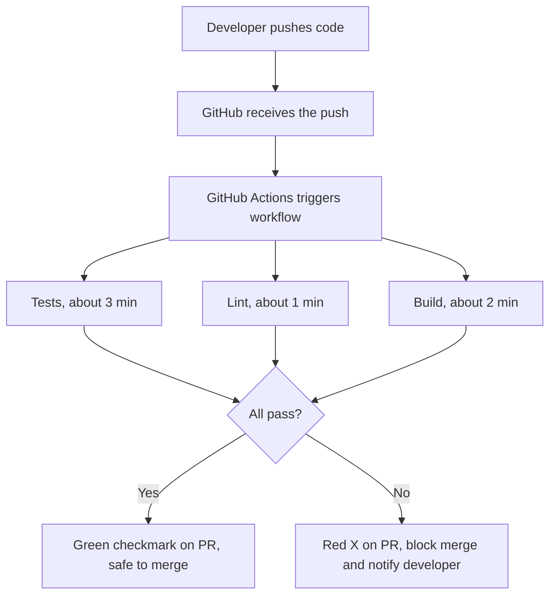
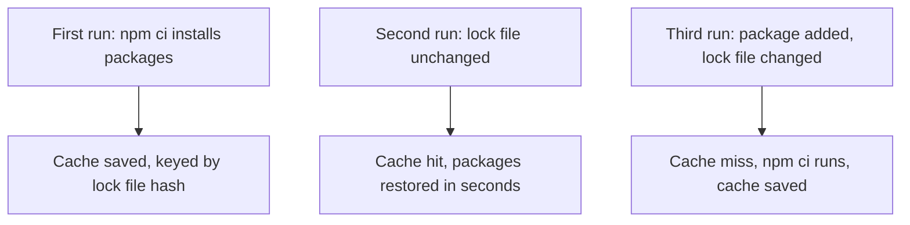

# Day 2 - Continuous Integration

> **Goal:** Turn every push and pull request into an automatic quality gate - install dependencies, run tests, lint, build across versions, cache for speed, publish artifacts, and block any merge that breaks the build.

## Learning Objectives

By the end of this lesson you will be able to:
- Build a CI workflow that installs, tests, and lints an app on every push and PR.
- Run tests across multiple versions in parallel with a **matrix**.
- Speed up builds by **caching** dependencies the right way.
- Produce and download **build artifacts**.
- Enforce quality with **status checks + branch protection** so broken code cannot merge.

## Table of Contents

1. [What a CI Pipeline Does](#1-what-a-ci-pipeline-does)
2. [Setting Up a Sample App](#2-setting-up-a-sample-app)
3. [Running Tests Automatically](#3-running-tests-automatically)
4. [Linting & Code Quality](#4-linting--code-quality)
5. [Matrix Builds](#5-matrix-builds)
6. [Caching Dependencies](#6-caching-dependencies)
7. [Build Artifacts](#7-build-artifacts)
8. [Status Checks & Branch Protection](#8-status-checks--branch-protection)
9. [Reusable Workflows and Composite Actions](#9-reusable-workflows-and-composite-actions-stop-repeating-yourself)
10. [Lab - Full CI Pipeline](#lab--full-ci-pipeline)

---

## 1. What a CI Pipeline Does

A CI pipeline is the automated gatekeeper for your codebase. Every time a developer pushes code or opens a PR, the pipeline runs and answers one question: **"Is this code safe to merge?"**

**A real-world analogy:** A CI pipeline is like a restaurant kitchen where every dish is taste-tested before it leaves the kitchen. The dish (your code change) is checked by several inspectors at once - one tastes it, one checks the presentation, one checks it was cooked safely. Only if all of them approve does the plate go out to the customer. If any inspector says no, the plate goes back and the cook is told exactly what to fix.

### The CI Pipeline Lifecycle



### What CI Checks For

| Check | Why It Matters |
|---|---|
| Unit tests | Verify individual functions work correctly |
| Integration tests | Verify components work together |
| Linting | Enforce coding standards, catch bugs early |
| Formatting | Keep code style consistent across team |
| Type checking | Catch type errors before runtime |
| Security scanning | Find known vulnerabilities in dependencies |
| Code coverage | Ensure new code has tests |
| Build | Verify the app actually compiles/builds |

---

## 2. Setting Up a Sample App

We'll use a simple Node.js app throughout this module. The same concepts apply to Python, Go, Java, etc.

### The App

```
02-ci/app/
├── src/
│   ├── index.js       ← entry point
│   ├── calculator.js  ← business logic
│   └── utils.js       ← utilities
├── tests/
│   ├── calculator.test.js
│   └── utils.test.js
├── package.json
└── .eslintrc.json
```

### `package.json`

```json
{
  "name": "learn-cicd-app",
  "version": "1.0.0",
  "scripts": {
    "start": "node src/index.js",
    "test": "jest --coverage",
    "test:watch": "jest --watch",
    "lint": "eslint src/ tests/",
    "lint:fix": "eslint src/ tests/ --fix",
    "build": "echo 'Build step - would compile/bundle here'"
  },
  "dependencies": {
    "express": "^4.18.2"
  },
  "devDependencies": {
    "jest": "^29.0.0",
    "eslint": "^8.0.0",
    "@eslint/js": "^8.0.0"
  }
}
```

### `src/calculator.js` (sample business logic)

```javascript
/**
 * Adds two numbers together.
 * @param {number} a
 * @param {number} b
 * @returns {number}
 */
function add(a, b) {
  if (typeof a !== 'number' || typeof b !== 'number') {
    throw new TypeError('Arguments must be numbers');
  }
  return a + b;
}

/**
 * Subtracts b from a.
 */
function subtract(a, b) {
  if (typeof a !== 'number' || typeof b !== 'number') {
    throw new TypeError('Arguments must be numbers');
  }
  return a - b;
}

/**
 * Divides a by b.
 * @throws {Error} if b is zero
 */
function divide(a, b) {
  if (b === 0) {
    throw new Error('Cannot divide by zero');
  }
  return a / b;
}

module.exports = { add, subtract, divide };
```

### `tests/calculator.test.js`

```javascript
const { add, subtract, divide } = require('../src/calculator');

describe('Calculator', () => {
  describe('add()', () => {
    test('adds two positive numbers', () => {
      expect(add(2, 3)).toBe(5);
    });

    test('adds negative numbers', () => {
      expect(add(-1, -2)).toBe(-3);
    });

    test('throws TypeError for non-numbers', () => {
      expect(() => add('a', 1)).toThrow(TypeError);
    });
  });

  describe('subtract()', () => {
    test('subtracts correctly', () => {
      expect(subtract(10, 4)).toBe(6);
    });
  });

  describe('divide()', () => {
    test('divides correctly', () => {
      expect(divide(10, 2)).toBe(5);
    });

    test('throws Error when dividing by zero', () => {
      expect(() => divide(10, 0)).toThrow('Cannot divide by zero');
    });
  });
});
```

---

## 3. Running Tests Automatically

### The Basic Test Workflow

```yaml
# .github/workflows/ci.yml
name: CI

on:
  push:
    branches: [main, develop, 'release/**', 'hotfix/**']
  pull_request:
    branches: [develop, main]   # features → develop, releases/hotfixes → main

jobs:
  test:
    name: Run Tests
    runs-on: ubuntu-latest

    steps:
      # Step 1: Get the code
      - name: Checkout code
        uses: actions/checkout@v4

      # Step 2: Set up the runtime
      - name: Set up Node.js
        uses: actions/setup-node@v4
        with:
          node-version: '20'
          cache: 'npm'        # cache node_modules between runs

      # Step 3: Install dependencies
      # 'npm ci' is BETTER than 'npm install' for CI:
      #   - Reads package-lock.json exactly (reproducible)
      #   - Fails if package-lock.json is out of sync
      #   - Faster on clean installs
      - name: Install dependencies
        run: npm ci

      # Step 4: Run the tests
      - name: Run tests
        run: npm test

      # Step 5: Upload coverage report as artifact
      - name: Upload coverage report
        uses: actions/upload-artifact@v4
        if: always()   # run even if tests fail
        with:
          name: coverage-report
          path: coverage/
          retention-days: 7
```

### `npm ci` vs `npm install` - Know the Difference

| Feature | `npm install` | `npm ci` |
|---|---|---|
| Purpose | Development - add/update packages | CI - exact reproducible install |
| Reads | `package.json` | `package-lock.json` (exact versions) |
| `node_modules` | Merges/updates | Deletes and reinstalls fresh |
| Lock file mismatch | Updates lock file | **FAILS** (alerts you to inconsistency) |
| Speed on clean install | Slower | Faster |
| Use in CI | Never | Always |

---

### Step `if` Conditions

You can make steps conditional:

```yaml
steps:
  - name: Run tests
    run: npm test

  # This step runs even if tests fail (useful for uploading failure reports)
  - name: Upload test results
    uses: actions/upload-artifact@v4
    if: always()          # always run this step

  # Only run on main branch
  - name: Deploy
    if: github.ref == 'refs/heads/main'
    run: ./deploy.sh

  # Only run if previous step failed
  - name: Notify on failure
    if: failure()
    run: echo "Tests failed!"

  # Only run if all previous steps succeeded
  - name: Post success
    if: success()
    run: echo "All good!"
```

### Step Outputs

Steps can produce outputs that later steps can use:

```yaml
steps:
  - name: Get version
    id: version          # give the step an ID to reference later
    # Read the version straight from package.json (node is already set up).
    # jq -r .version package.json also works if you prefer.
    run: echo "version=$(node -p "require('./package.json').version")" >> "$GITHUB_OUTPUT"

  - name: Use version
    run: echo "Building version ${{ steps.version.outputs.version }}"
```

---

## 4. Linting & Code Quality

### What is Linting?

A **linter** is a tool that analyzes source code to flag:
- Programming errors (using undefined variables)
- Bugs (unreachable code)
- Style violations (inconsistent quotes, missing semicolons)
- Suspicious patterns (unused variables, overly complex expressions)

Linting in CI means these issues are caught automatically before code is merged - no more review comments like "please remove that console.log".

### ESLint (JavaScript/TypeScript)

**`.eslintrc.json`:**
```json
{
  "env": {
    "node": true,
    "es2021": true,
    "jest": true
  },
  "extends": ["eslint:recommended"],
  "rules": {
    "no-unused-vars": "error",
    "no-console": "warn",
    "eqeqeq": "error",
    "no-var": "error",
    "prefer-const": "error"
  }
}
```

**Adding lint to CI:**
```yaml
  lint:
    name: Lint
    runs-on: ubuntu-latest

    steps:
      - uses: actions/checkout@v4
      - uses: actions/setup-node@v4
        with:
          node-version: '20'
          cache: 'npm'
      - run: npm ci
      - name: Run ESLint
        run: npm run lint
```

### Prettier (Code Formatting)

Prettier enforces a consistent code style automatically. In CI, you check that code *was* formatted - you don't format it (that would change files and break the workflow).

```yaml
      - name: Check formatting
        run: npx prettier --check "src/**/*.js"
        # Use --check in CI (exits with error if files need formatting)
        # Use --write locally to actually format
```

### Python Linting

**Flake8:**
```yaml
  lint:
    runs-on: ubuntu-latest
    steps:
      - uses: actions/checkout@v4
      - uses: actions/setup-python@v5
        with:
          python-version: '3.11'
      - run: pip install flake8
      - name: Run Flake8
        run: flake8 . --count --max-line-length=88 --statistics
```

**Black (formatter check):**
```yaml
      - name: Check Black formatting
        run: |
          pip install black
          black --check .
```

### Security Scanning

**Dependency vulnerability scanning:**
```yaml
      - name: Audit dependencies
        run: npm audit --audit-level=high
        # Fails if any HIGH or CRITICAL vulnerabilities found
```

**GitHub's built-in CodeQL (advanced):**
```yaml
  security:
    runs-on: ubuntu-latest
    permissions:
      security-events: write
      actions: read
      contents: read

    steps:
      - uses: actions/checkout@v4
      - name: Initialize CodeQL
        uses: github/codeql-action/init@v3
        with:
          languages: javascript
      - name: Perform CodeQL Analysis
        uses: github/codeql-action/analyze@v3
```

---

## 5. Matrix Builds

### What is a Matrix Build?

A **matrix build** lets you run the same job with different configurations in parallel. This is how you test that your code works on:
- Multiple Node.js versions (e.g. 18, 20, 22 - use current/LTS versions, not end-of-life ones)
- Multiple operating systems (Ubuntu, Windows, macOS)
- Multiple Python versions
- Multiple database versions

Instead of writing three separate jobs, you define the matrix and GitHub runs them all in parallel.

### Basic Matrix

```yaml
jobs:
  test:
    name: Test on Node ${{ matrix.node-version }}
    runs-on: ubuntu-latest

    strategy:
      matrix:
        node-version: [18, 20, 22]
        # This creates 3 jobs:
        #   test (node-version: 18)
        #   test (node-version: 20)
        #   test (node-version: 22)
        # All run in parallel!

    steps:
      - uses: actions/checkout@v4
      - uses: actions/setup-node@v4
        with:
          node-version: ${{ matrix.node-version }}   # use the matrix value
      - run: npm ci
      - run: npm test
```

### Multi-Dimensional Matrix

```yaml
strategy:
  matrix:
    os: [ubuntu-latest, windows-latest, macos-latest]
    node-version: [18, 20]
    # Creates 3 × 2 = 6 jobs running in parallel

jobs:
  test:
    runs-on: ${{ matrix.os }}   # use matrix value for runner too
    steps:
      - uses: actions/checkout@v4
      - uses: actions/setup-node@v4
        with:
          node-version: ${{ matrix.node-version }}
      - run: npm ci
      - run: npm test
```

### Excluding Combinations

```yaml
strategy:
  matrix:
    os: [ubuntu-latest, windows-latest, macos-latest]
    node-version: [18, 20]
    exclude:
      # Don't test Node 18 on macOS (saves cost, rarely needed)
      - os: macos-latest
        node-version: 18
```

### Including Extra Combinations

```yaml
strategy:
  matrix:
    os: [ubuntu-latest]
    node-version: [18, 20]
    include:
      # Add a special extra job with additional config
      - os: ubuntu-latest
        node-version: 20
        experimental: true   # custom variable for this combination only
```

### fail-fast

```yaml
strategy:
  fail-fast: false   # default is true
  matrix:
    node-version: [18, 20, 22]

# fail-fast: true (default) - if one matrix job fails, cancel all others
# fail-fast: false - let all matrix jobs run regardless of failures
# Use false when you want to see ALL failures across versions
```

---

## 6. Caching Dependencies

### Why Cache?

Installing dependencies (npm install, pip install) takes time. If you have 500 packages, installing them on every CI run wastes minutes.

**Caching stores the installed packages between runs.** The cache key is based on the lock file - if `package-lock.json` changes, the cache is invalidated and packages are reinstalled fresh.

Caching is like keeping prepped ingredients in the fridge instead of shopping from scratch before every single meal. As long as your shopping list (the lock file) has not changed, you just grab what is already chopped and ready. The moment the list changes, you go shopping again and refill the fridge.

### How Caching Works



### Node.js Cache (Built-in)

`actions/setup-node` has built-in caching:

```yaml
- uses: actions/setup-node@v4
  with:
    node-version: '20'
    cache: 'npm'         # or 'yarn' or 'pnpm'
    # Automatically caches node_modules based on package-lock.json hash
```

### Manual Cache (More Control)

Cache the package manager's **download cache** (`~/.npm`), NOT `node_modules` itself, and **always run `npm ci`**. Caching `node_modules` directly is a common anti-pattern: it can hold platform-specific binaries that break on a different runner, and skipping `npm ci` on a cache hit bypasses the integrity checks that make `npm ci` reliable.

```yaml
- name: Cache npm downloads
  uses: actions/cache@v4
  with:
    path: ~/.npm                 # the npm DOWNLOAD cache (not node_modules)
    key: ${{ runner.os }}-npm-${{ hashFiles('**/package-lock.json') }}
    # If package-lock.json changes, the hash changes -> new key -> cache miss (correct).
    restore-keys: |
      ${{ runner.os }}-npm-      # fallback: reuse an older cache to speed the install

- name: Install dependencies
  run: npm ci                    # ALWAYS run - it is fast on a warm cache AND verifies integrity
```

> `actions/setup-node` with `cache: 'npm'` (shown above) already does exactly this for you. Reach for the manual `actions/cache` only for something `setup-node` does not cover (a build output directory, a non-standard tool, etc.).

### Python Cache

```yaml
- uses: actions/setup-python@v5
  with:
    python-version: '3.11'
    cache: 'pip'         # built-in pip cache

# Or manual:
- uses: actions/cache@v4
  with:
    path: ~/.cache/pip
    key: ${{ runner.os }}-pip-${{ hashFiles('requirements.txt') }}
- run: pip install -r requirements.txt
```

### Cache Size Limits

- GitHub caches are limited to **10 GB per repository**
- Caches unused for **7 days** are deleted automatically
- Each runner OS has its own separate cache

---

## 7. Build Artifacts

### What is an Artifact?

An **artifact** is a file or directory produced by a workflow that you want to save and share. An artifact is like a lunchbox handed from one worker to the next: the build job packs up the finished meal, and a later job opens the same lunchbox instead of cooking everything again. This matters because each job runs on its own fresh runner, so files do not travel between jobs unless you pack them into an artifact. Examples:
- Test coverage reports
- Compiled binaries
- Docker images
- Log files
- Build output (`dist/` folder)

### Uploading Artifacts

```yaml
- name: Build application
  run: npm run build    # produces dist/ folder

- name: Upload build output
  uses: actions/upload-artifact@v4
  with:
    name: build-output          # artifact name (shows in GitHub UI)
    path: dist/                 # path to upload
    retention-days: 30          # how long to keep it (default: 90)
    if-no-files-found: error    # fail if nothing was produced
```

**Upload multiple paths:**
```yaml
- uses: actions/upload-artifact@v4
  with:
    name: test-results
    path: |
      coverage/
      test-results.xml
      *.log
```

### Downloading Artifacts

In a later job (or a different workflow):

```yaml
  deploy:
    needs: build     # ensure build job ran first
    steps:
      - name: Download build artifact
        uses: actions/download-artifact@v4
        with:
          name: build-output    # must match the upload name
          path: ./dist          # where to put the downloaded files

      - name: Deploy
        run: ./deploy.sh dist/
```

### Passing Data Between Jobs

Jobs run on separate machines, so you can't just share files. Use artifacts:

```yaml
jobs:
  build:
    runs-on: ubuntu-latest
    steps:
      - uses: actions/checkout@v4
      - run: npm ci && npm run build
      - uses: actions/upload-artifact@v4
        with:
          name: dist
          path: dist/

  test-e2e:
    needs: build
    runs-on: ubuntu-latest
    steps:
      - uses: actions/checkout@v4
      - uses: actions/download-artifact@v4
        with:
          name: dist
          path: dist/
      - run: npm run test:e2e   # tests against the built app
```

---

## 8. Status Checks & Branch Protection

### What are Status Checks?

Every CI job reports a status to GitHub:
- Green checkmark = passed
- Red X = failed
- Yellow circle = in progress

These statuses appear on:
- Pull Request pages
- Commit history
- The branch itself

### Branch Protection Rules

**Branch protection** prevents code from being merged unless certain conditions are met. This enforces your CI gates.

**To set up (GitHub UI):**
1. Repo, then Settings, then Branches
2. Click "Add branch protection rule"
3. Branch name pattern: `main`
4. Check: "Require status checks to pass before merging"
5. Search and add your CI job names
6. Check: "Require branches to be up to date before merging"
7. Check: "Include administrators" (optional but recommended)

**Result:** GitHub will block the "Merge" button until all required CI checks pass.

### Reporting Custom Status Checks

```yaml
# You can also create custom status checks via the API
- name: Report custom status
  uses: actions/github-script@v7
  with:
    script: |
      await github.rest.repos.createCommitStatus({
        owner: context.repo.owner,
        repo: context.repo.repo,
        sha: context.sha,
        state: 'success',      // 'error', 'failure', 'pending', 'success'
        description: 'All checks passed',
        context: 'my-custom-check'
      })
```

---

## 9. Reusable Workflows and Composite Actions (Stop Repeating Yourself)

Notice how every job starts the same way: `checkout`, `setup-node`, `npm ci`. Copying that into your lint, test, and build jobs is exactly the duplication CI/CD is supposed to remove. Two tools fix it.

### Composite actions - bundle repeated STEPS

A composite action packages a sequence of steps into **one reusable step**. Put it in your repo at `.github/actions/setup/action.yml`:

```yaml
# .github/actions/setup/action.yml
name: Setup
description: Checkout, install Node, and restore dependencies
runs:
  using: composite
  steps:
    - uses: actions/checkout@v4
    - uses: actions/setup-node@v4
      with:
        node-version: "20"
        cache: "npm"
    - run: npm ci
      shell: bash          # composite 'run' steps MUST declare a shell
```

Every job then collapses to a single line:

```yaml
jobs:
  test:
    runs-on: ubuntu-latest
    steps:
      - uses: ./.github/actions/setup    # the whole checkout + node + install
      - run: npm test
```

### Reusable workflows - share a whole JOB across workflows or repos

A reusable workflow is a full workflow other workflows can **call** with `on: workflow_call`:

```yaml
# .github/workflows/ci.yml  (the reusable one)
on:
  workflow_call:
    inputs:
      node-version:
        type: string
        default: "20"
jobs:
  test:
    runs-on: ubuntu-latest
    steps:
      - uses: actions/checkout@v4
      - uses: actions/setup-node@v4
        with:
          node-version: ${{ inputs.node-version }}
          cache: "npm"
      - run: npm ci && npm test
```

```yaml
# any other workflow calls it (even from another repo, pinned to a tag)
jobs:
  call-ci:
    uses: ./.github/workflows/ci.yml     # or my-org/shared/.github/workflows/ci.yml@v1
    with:
      node-version: "22"
```

> **Which one?** A **composite action** bundles **steps** and runs inside an existing job - perfect for a repeated step sequence. A **reusable workflow** bundles **whole jobs** (its own runners) and is meant to standardise entire pipelines across many repositories.

---

## Lab - Full CI Pipeline

### Objective

Build a complete CI pipeline for the sample app that:
1. Runs on every PR and push to `main`
2. Tests on Node 18 and 20
3. Lints the code
4. Checks formatting
5. Reports code coverage
6. Saves the coverage report as an artifact

### The Complete Workflow

```yaml
# .github/workflows/ci.yml
name: CI

on:
  push:
    branches: [main, develop, 'release/**', 'hotfix/**']
  pull_request:
    branches: [develop, main]   # features → develop, releases/hotfixes → main

env:
  NODE_VERSION_MATRIX: '[18, 20]'

jobs:
  # ─── JOB 1: Lint ────────────────────────────────────────────────
  lint:
    name: Lint & Format Check
    runs-on: ubuntu-latest

    steps:
      - name: Checkout code
        uses: actions/checkout@v4

      - name: Set up Node.js
        uses: actions/setup-node@v4
        with:
          node-version: '20'
          cache: 'npm'

      - name: Install dependencies
        run: npm ci

      - name: Run ESLint
        run: npm run lint

      - name: Check Prettier formatting
        run: npx prettier --check "src/**/*.js" "tests/**/*.js"

  # ─── JOB 2: Test (Matrix) ───────────────────────────────────────
  test:
    name: Test (Node ${{ matrix.node-version }})
    runs-on: ubuntu-latest

    strategy:
      fail-fast: false
      matrix:
        node-version: [18, 20]

    steps:
      - name: Checkout code
        uses: actions/checkout@v4

      - name: Set up Node.js ${{ matrix.node-version }}
        uses: actions/setup-node@v4
        with:
          node-version: ${{ matrix.node-version }}
          cache: 'npm'

      - name: Install dependencies
        run: npm ci

      - name: Run tests with coverage
        run: npm test -- --coverage --coverageReporters=text --coverageReporters=lcov

      - name: Upload coverage report
        uses: actions/upload-artifact@v4
        if: matrix.node-version == 20   # only upload once
        with:
          name: coverage-node-${{ matrix.node-version }}
          path: coverage/
          retention-days: 7

  # ─── JOB 3: Build ───────────────────────────────────────────────
  build:
    name: Build
    runs-on: ubuntu-latest
    needs: [lint, test]     # only build if lint and tests pass

    steps:
      - name: Checkout code
        uses: actions/checkout@v4

      - name: Set up Node.js
        uses: actions/setup-node@v4
        with:
          node-version: '20'
          cache: 'npm'

      - name: Install dependencies
        run: npm ci

      - name: Build application
        run: npm run build

      - name: Upload build artifact
        uses: actions/upload-artifact@v4
        with:
          name: build-output
          path: dist/
          if-no-files-found: warn
          retention-days: 7
```

### Running It

1. Copy the workflow to `.github/workflows/ci.yml`
2. Copy the sample app to `02-ci/app/`
3. Push to a new branch
4. Open a PR
5. Watch the CI run - you'll see 4 jobs: lint, test (Node 18), test (Node 20), build

### Challenge

Extend the pipeline to:
1. Add a security audit step (`npm audit`)
2. Add a step that posts a comment on the PR with the test coverage percentage
3. Run tests on `ubuntu-latest` AND `windows-latest`

### Coverage PR Comment Solution

```yaml
      - name: Get coverage summary
        id: coverage
        run: |
          COVERAGE=$(npx jest --coverage --coverageReporters=text-summary 2>&1 | grep "Statements" | awk '{print $3}')
          echo "percentage=$COVERAGE" >> $GITHUB_OUTPUT

      - name: Comment on PR
        uses: actions/github-script@v7
        if: github.event_name == 'pull_request'
        with:
          script: |
            await github.rest.issues.createComment({
              issue_number: context.issue.number,
              owner: context.repo.owner,
              repo: context.repo.repo,
              body: `## Test Coverage Report\n\nCoverage: **${{ steps.coverage.outputs.percentage }}**`
            })
```

---

## Common Mistakes

These are the pitfalls that catch almost every beginner. Knowing them in advance saves hours of confusion.

- Using `npm install` instead of `npm ci` in CI. `npm install` can quietly change your lock file and pull slightly different versions, so the pipeline tests something different from what you committed. `npm ci` installs the exact versions from `package-lock.json` and fails loudly if they do not match.
- Not pinning action versions. Writing `uses: actions/checkout` with no version, or trusting a moving tag, means a future update to that action can break your pipeline overnight. Pin to a major version like `actions/checkout@v4`, or a full commit SHA for stricter security.
- Forgetting `fail-fast: false` in a matrix. By default, the moment one combination fails, GitHub cancels the rest. You then see only the first failure and have to guess about the others. Setting `fail-fast: false` lets every combination finish so you see the full picture.
- Hardcoding secrets in the workflow file. Anyone who can read the repository can read the file, and the value lives forever in Git history. Store tokens and keys in GitHub Secrets and read them with `${{ secrets.MY_TOKEN }}`.
- Expecting files to persist between jobs. Each job runs on a fresh runner, so a file created in one job is gone in the next. To pass a build result along, upload it as an artifact in one job and download it in the next.
- Running the full pipeline on docs-only changes. Editing a single README should not spin up a 10 minute build. Use a `paths` or `paths-ignore` filter on your triggers so the heavy jobs run only when real code changes.

---

## Quick Self-Check

Test yourself before moving on. If you can answer these in your own words, you are ready.

1. In one sentence, what question does a CI pipeline answer every time code is pushed?
2. What is the difference between `npm install` and `npm ci`, and which belongs in CI?
3. You need to test your app on Node 18, 20, and 22 in one workflow. Which feature do you use, and what does `fail-fast: false` change about the result?
4. Why does caching speed up a pipeline, and what causes a cache to be rebuilt?
5. A build job produces a `dist/` folder that a later deploy job needs. Why can the deploy job not just read the file directly, and what do you use instead?

---

## Summary

| Concept | Key Point |
|---|---|
| `npm ci` | Always use in CI - reproducible, strict |
| Lint | Catches bugs and style issues automatically |
| Matrix | Test multiple versions/platforms in parallel |
| `fail-fast: false` | See all matrix failures, not just the first |
| Cache | `hashFiles(lock-file)` as the cache key |
| Artifacts | Share files between jobs or save for later |
| Branch protection | Enforce CI gates on PRs |

---

**Next up ->** [Day 3 - Secrets & Environments](../day3-secrets-environments/notes.md)
