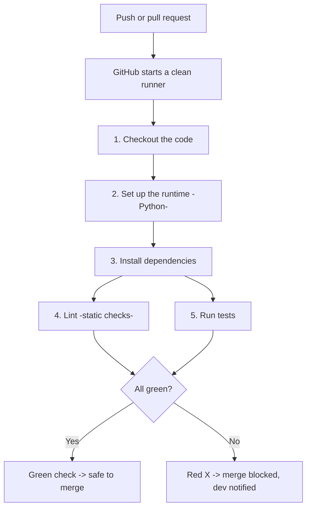
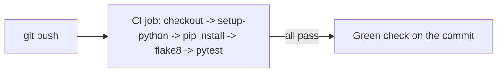
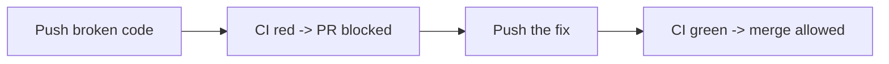

# Day 2 - Continuous Integration

> **Goal:** Turn every push and pull request into an automatic **quality gate** that answers one question - *"is this change safe to merge?"* - by installing, testing, linting, and packaging the app, and blocking any merge that breaks the build.

We use **one small app the whole way through** - the Python **Flask** app in [`../demo/`](../demo/README.md) - so the concepts here connect directly to the runnable demo you finish the lesson with. The ideas are identical in Node, Go, or Java; only the commands change.

## Learning Objectives

By the end of this lesson you will be able to:
- Explain what CI actually is (a practice **and** a pipeline) and where it ends.
- Build a CI workflow that installs, tests, and lints the app on every push and PR.
- Make CI **fast and trustworthy** with matrix builds and dependency caching.
- Produce and store **build artifacts**.
- Enforce quality with **status checks + branch protection** so broken code cannot merge.
- **Run the demo** and watch CI block a broken change with your own eyes.

## Table of Contents

1. [What CI Really Is](#1-what-ci-really-is)
2. [Anatomy of a CI Run](#2-anatomy-of-a-ci-run)
3. [The Demo App We Will Use](#3-the-demo-app-we-will-use)
4. [Running Tests Automatically](#4-running-tests-automatically)
5. [Linting and Code Quality](#5-linting-and-code-quality)
6. [Making CI Fast and Reliable](#6-making-ci-fast-and-reliable)
7. [Build Artifacts](#7-build-artifacts)
8. [The Quality Gate: Status Checks and Branch Protection](#8-the-quality-gate-status-checks-and-branch-protection)
9. [Stop Repeating Yourself: Reusable Workflows and Composite Actions](#9-stop-repeating-yourself-reusable-workflows-and-composite-actions)
10. [CI Demo - Watch It Work](#10-ci-demo---watch-it-work)
11. [Lab - Build the Full CI Pipeline](#lab---build-the-full-ci-pipeline)

---

## 1. What CI Really Is

A CI pipeline is the **automated gatekeeper** for your codebase. Every time someone pushes code or opens a pull request, it runs and answers: **"Is this code safe to merge?"**

> **Analogy:** CI is a restaurant kitchen where every dish is tasted before it leaves. One inspector tastes it, one checks the presentation, one checks it was cooked safely. Only if **all** approve does the plate go out. If any says no, the plate comes back with a note on exactly what to fix.

### Is CI just tests, or also building and artifacts? (the common confusion)

You will hear both, so here is the accurate answer:

- CI is first a **practice**: integrate your code into the shared branch **often**, and **automatically verify every integration**. The original definition is literally an *"automated build, including tests"* - so **building was part of CI from the start**, not an afterthought.
- A real CI pipeline does **build + test + lint**, and usually **packages the result into a versioned artifact** (a package or a Docker image). Tests are the most *visible* part, which is why people say "CI is tests" - but that is only a slice.

**Where does CI end?** At a **tested, packaged artifact**. CI does **not** deploy. The artifact is the **handoff to CD**:

```
CI:  integrate -> build -> test -> lint -> package
                                              |
                                              v   [verified, versioned artifact]
                                              |
CD:  take that artifact -> deploy / release it
```

So **"CI = just tests" is too narrow.** CI **builds and tests (and packages)**; **CD deploys**. Building the artifact belongs to CI; *shipping* it belongs to CD.

> One more source of confusion: people mix up **CI the practice** (integrate frequently) with **CI the pipeline** (the automated job that runs on every push). In everyday talk, "CI" usually means that pipeline - which is what this whole lesson builds.

---

## 2. Anatomy of a CI Run

Every CI run is the same shape, whatever the language. On a push or PR, GitHub spins up a **fresh, clean machine** (a runner) and executes these stages in order:



**What CI typically checks:**

| Check | What it catches |
|---|---|
| **Tests** (unit + integration) | Broken behaviour - the core of CI |
| **Lint / static analysis** | Bugs, undefined names, risky patterns |
| **Formatting** | Inconsistent style across the team |
| **Security scanning** | Known vulnerabilities in dependencies |
| **Coverage** | New code shipped without tests |
| **Build / package** | The app does not actually build or containerise |

Two facts that explain almost everything else in this lesson:
1. **The runner is wiped after the job.** Nothing survives to the next job unless you cache it or save it as an artifact (Sections 6 and 7).
2. **Jobs run on separate machines, in parallel by default.** You order them with `needs:` when one must wait for another.

---

## 3. The Demo App We Will Use

A tiny **Flask** app - deliberately small so the focus stays on the *pipeline*, not the app. The full runnable version (Dockerfile, k8s manifests, workflows) lives in [`../demo/`](../demo/README.md).

```
demo/
├── app/main.py            # the Flask app: GET / and GET /health
├── tests/test_app.py      # pytest tests (what CI runs)
├── requirements.txt       # pinned dependencies
├── .flake8                # lint config
├── Dockerfile             # packages the app (used by CD, Day 4)
└── k8s/                   # deployment + service (CD target, Day 4/5)
```

### `app/main.py`

```python
import os
from flask import Flask, jsonify

app = Flask(__name__)
# Version comes from an env var so a deploy can PROVE a new version shipped.
APP_VERSION = os.getenv("APP_VERSION", "dev")

@app.route("/")
def home():
    return f"<h1>Hello from the CI/CD demo!</h1><p>Version: {APP_VERSION}</p>"

@app.route("/health")
def health():
    # Kubernetes probes and the pipeline smoke test both call this.
    return jsonify(status="ok", version=APP_VERSION)
```

### `tests/test_app.py`

```python
import sys, os
sys.path.insert(0, os.path.join(os.path.dirname(__file__), "..", "app"))
import main  # noqa: E402

def client():
    main.app.config["TESTING"] = True
    return main.app.test_client()

def test_home_returns_200():
    r = client().get("/")
    assert r.status_code == 200
    assert b"Hello from the CI/CD demo" in r.data

def test_health_returns_ok():
    r = client().get("/health")
    assert r.status_code == 200
    assert r.get_json()["status"] == "ok"

def test_unknown_route_returns_404():
    assert client().get("/nope").status_code == 404
```

### `requirements.txt` (pinned)

```
flask==3.0.3
gunicorn==22.0.0
pytest==8.2.0
```

> **Why pin exact versions (`==`)?** So CI installs the **same** dependencies every time. If you wrote `flask>=3` instead, a new Flask release could change behaviour and turn your pipeline red for no code change of yours. Pinning is the Python equivalent of committing a lock file. (In Node the same idea is enforced by `npm ci`, which installs exactly what `package-lock.json` says.)

---

## 4. Running Tests Automatically

The heart of CI: run the tests on **every push and every pull request**, and fail the run if any test breaks.

```yaml
# .github/workflows/ci.yml
name: CI

on:
  push:
    branches: [main]
  pull_request:
    branches: [main]
  # (In a GitFlow repo you would also add develop, release/**, etc.)

jobs:
  test:
    name: Test
    runs-on: ubuntu-latest
    steps:
      - name: Checkout code
        uses: actions/checkout@v4

      - name: Set up Python
        uses: actions/setup-python@v5
        with:
          python-version: "3.12"
          cache: "pip"          # cache pip downloads between runs (Section 6)

      - name: Install dependencies
        run: pip install -r requirements.txt

      - name: Run tests
        run: pytest -v
```

**Why run on `pull_request` too, not just `push`?** Because you want the gate to fail **before** a merge, while the change is still a PR. Push-only CI tells you it is broken *after* it is already on `main` - too late.

### Making steps conditional with `if`

```yaml
steps:
  - name: Run tests
    run: pytest -v

  - name: Upload results even on failure
    uses: actions/upload-artifact@v4
    if: always()                       # run this step regardless of test result

  - name: Notify only when something failed
    if: failure()
    run: echo "Tests failed!"

  - name: Deploy only from main
    if: github.ref == 'refs/heads/main'
    run: ./deploy.sh
```

`always()`, `failure()`, `success()` and expressions like `github.ref == '...'` let a step decide whether to run. `if: always()` on an upload step is the classic way to still collect logs/reports when tests fail.

### Passing a value to a later step (step outputs)

```yaml
steps:
  - name: Read the app version
    id: ver
    run: echo "version=$(python -c 'import app.main as m; print(m.APP_VERSION)')" >> "$GITHUB_OUTPUT"

  - name: Use it
    run: echo "Testing version ${{ steps.ver.outputs.version }}"
```

Write `key=value` to the `$GITHUB_OUTPUT` file, give the step an `id`, and later steps read `${{ steps.<id>.outputs.<key> }}`.

---

## 5. Linting and Code Quality

A **linter** reads your code (without running it) and flags real errors (undefined names, unreachable code) and style problems (unused imports, bad formatting). Running it in CI means these are caught automatically - no more review comments like "you left a debug print in."

### Flake8 (Python)

The demo ships a `.flake8` config:

```ini
[flake8]
max-line-length = 120
extend-ignore = E501
exclude = venv,.venv,__pycache__
```

Add it as its own job so lint failures are reported separately from test failures:

```yaml
  lint:
    name: Lint
    runs-on: ubuntu-latest
    steps:
      - uses: actions/checkout@v4
      - uses: actions/setup-python@v5
        with:
          python-version: "3.12"
      - run: pip install flake8
      - name: Run flake8
        run: flake8 app tests
```

> A pragmatic pattern (used in the demo) is to **fail only on real errors** and treat pure style as warnings, so a stray blank line does not block a merge:
> `flake8 app --select=E9,F63,F7,F82 --show-source --statistics` (E9/F-codes are syntax and undefined-name errors).

### Black (formatting check)

`black` auto-formats Python. In CI you **check** that code was formatted (you do not reformat - that would change files mid-run):

```yaml
      - run: pip install black
      - name: Check formatting
        run: black --check .        # exits non-zero if anything is unformatted
```

### Security scanning

```yaml
      - name: Audit dependencies for known CVEs
        run: |
          pip install pip-audit
          pip-audit -r requirements.txt
```

> Other languages, same idea: **ESLint/Prettier** for JavaScript, `golangci-lint` for Go, `npm audit` for Node dependencies. The *job* is identical - only the tool changes.

---

## 6. Making CI Fast and Reliable

Two levers make CI both quick and trustworthy: run across versions in **parallel** (matrix), and avoid re-downloading dependencies every time (**caching**).

### Matrix builds - test several versions at once

A **matrix** runs the same job with different configurations, all in parallel - so you prove the app works on every version you support, without writing separate jobs.

```yaml
jobs:
  test:
    name: Test (Python ${{ matrix.python-version }})
    runs-on: ubuntu-latest
    strategy:
      fail-fast: false                 # see ALL failures, not just the first
      matrix:
        python-version: ["3.11", "3.12"]   # two jobs, run in parallel
    steps:
      - uses: actions/checkout@v4
      - uses: actions/setup-python@v5
        with:
          python-version: ${{ matrix.python-version }}
          cache: "pip"
      - run: pip install -r requirements.txt
      - run: pytest -v
```

Multi-dimensional (versions x operating systems):

```yaml
    strategy:
      matrix:
        os: [ubuntu-latest, windows-latest]
        python-version: ["3.11", "3.12"]   # 2 x 2 = 4 parallel jobs
    runs-on: ${{ matrix.os }}
```

- **`fail-fast: false`** - by default, the moment one matrix job fails GitHub cancels the rest and you only see the first failure. Set it `false` to let every combination finish so you see the full picture.
- **`exclude:` / `include:`** - drop a specific combination, or add an extra one with special settings.

### Caching dependencies

Installing packages on every run wastes minutes. **Caching** stores them between runs, keyed by your dependency file - if `requirements.txt` changes, the cache is rebuilt; otherwise it is restored in seconds.

> **Analogy:** caching is prepped ingredients in the fridge instead of shopping from scratch before every meal. As long as the shopping list (the lock/requirements file) has not changed, you grab what is already chopped.

The built-in cache (simplest - what the demo uses):

```yaml
- uses: actions/setup-python@v5
  with:
    python-version: "3.12"
    cache: "pip"           # caches the pip download cache, keyed by requirements files
```

Manual cache, for full control (cache the **download cache**, never the installed env, and **always run the install** so integrity is verified):

```yaml
- uses: actions/cache@v4
  with:
    path: ~/.cache/pip                                          # pip's DOWNLOAD cache
    key: ${{ runner.os }}-pip-${{ hashFiles('requirements.txt') }}
    restore-keys: ${{ runner.os }}-pip-                         # fallback to an older cache
- run: pip install -r requirements.txt                          # always run - fast on a warm cache
```

> Caches are ~10 GB per repo, evicted after 7 days unused, and separate per runner OS.

---

## 7. Build Artifacts

An **artifact** is a file or folder a job produces that you want to keep or hand to another job.

> **Analogy:** an artifact is a lunchbox passed from one worker to the next - the build job packs the finished meal, a later job opens the same box instead of cooking again. This matters because **each job runs on its own fresh runner**, so files do not travel between jobs unless you pack them into an artifact.

Common artifacts: a **coverage report**, a built package, log files, or a **Docker image** (the big one - it is the artifact CD deploys).

```yaml
      - name: Run tests with coverage
        run: |
          pip install pytest-cov
          pytest --cov=app --cov-report=html      # produces htmlcov/

      - name: Upload coverage report
        uses: actions/upload-artifact@v4
        if: always()                              # keep the report even if tests fail
        with:
          name: coverage-report
          path: htmlcov/
          retention-days: 7                        # auto-delete after a week
```

**Passing data between jobs** (upload in one, download in the next):

```yaml
jobs:
  build:
    runs-on: ubuntu-latest
    steps:
      - uses: actions/checkout@v4
      - run: python -m build           # produces dist/
      - uses: actions/upload-artifact@v4
        with: { name: dist, path: dist/ }

  test-package:
    needs: build                        # wait for build
    runs-on: ubuntu-latest
    steps:
      - uses: actions/download-artifact@v4
        with: { name: dist, path: dist/ }
      - run: echo "test the built package in dist/"
```

---

## 8. The Quality Gate: Status Checks and Branch Protection

CI is only useful if a **red pipeline actually stops bad code from merging**. That is what branch protection does - it turns your CI jobs into required gates.

Every CI job reports a status to GitHub: **green check** (passed), **red X** (failed), **yellow** (running). Those show up on the PR, the commit, and the branch.

**Branch protection** blocks the Merge button until conditions are met:

1. Repo -> **Settings** -> **Branches** -> **Add branch protection rule**
2. Branch name pattern: `main`
3. Check **"Require status checks to pass before merging"**
4. Search for and add your CI job names (e.g. `Test`, `Lint`)
5. Check **"Require branches to be up to date before merging"**
6. Optionally **"Include administrators"** so the rule applies to everyone

**Result:** a PR with a red CI check cannot be merged. This is the moment CI stops being a suggestion and becomes a gate. You will see this live in [Section 10](#10-ci-demo---watch-it-work).

---

## 9. Stop Repeating Yourself: Reusable Workflows and Composite Actions

Notice how every job starts the same way: `checkout`, `setup-python`, `pip install`. Copying that into your lint, test, and build jobs is exactly the duplication CI/CD is meant to remove. Two tools fix it.

### Composite actions - bundle repeated STEPS

Package a sequence of steps into **one reusable step** at `.github/actions/setup/action.yml`:

```yaml
# .github/actions/setup/action.yml
name: Setup
description: Checkout, set up Python, install deps
runs:
  using: composite
  steps:
    - uses: actions/checkout@v4
    - uses: actions/setup-python@v5
      with:
        python-version: "3.12"
        cache: "pip"
    - run: pip install -r requirements.txt
      shell: bash          # composite 'run' steps MUST declare a shell
```

Every job then collapses to:

```yaml
    steps:
      - uses: ./.github/actions/setup    # the whole checkout + python + install
      - run: pytest -v
```

### Reusable workflows - share a whole JOB across workflows or repos

A full workflow other workflows can **call** with `on: workflow_call`:

```yaml
# .github/workflows/ci.yml  (the reusable one)
on:
  workflow_call:
    inputs:
      python-version: { type: string, default: "3.12" }
jobs:
  test:
    runs-on: ubuntu-latest
    steps:
      - uses: actions/checkout@v4
      - uses: actions/setup-python@v5
        with:
          python-version: ${{ inputs.python-version }}
          cache: "pip"
      - run: pip install -r requirements.txt && pytest
```

```yaml
# another workflow calls it (even from another repo, pinned to a tag)
jobs:
  call-ci:
    uses: ./.github/workflows/ci.yml     # or my-org/shared/.github/workflows/ci.yml@v1
    with: { python-version: "3.11" }
```

> **Which one?** A **composite action** bundles **steps** (runs inside an existing job) - great for a repeated step sequence. A **reusable workflow** bundles **whole jobs** (its own runners) - meant to standardise entire pipelines across many repos.

---

## 10. CI Demo - Watch It Work

Concepts click when you *see* CI block a broken change. This uses the Flask app in [`../demo/`](../demo/README.md).

> **Key detail:** GitHub only runs workflows that live at the **repository root** under `.github/workflows/`. The demo keeps them in `demo/.github/workflows/` for reading, so to run them you copy the demo contents to a repo root.

### Step 1 - Put the demo in a GitHub repo

```bash
# In a new, empty GitHub repo cloned locally:
cp -r path/to/demo/* path/to/demo/.github .     # copy app, tests, requirements, AND .github
git add .
git commit -m "Add CI demo app"
git push origin main
```

Your repo root now has `app/`, `tests/`, `requirements.txt`, and `.github/workflows/ci.yml`.

### Step 2 - Watch CI pass

Open the repo's **Actions** tab. The **CI** workflow is already running:



You will see the steps stream live, then a green check. Congratulations - that is CI.

### Step 3 - Break a test on purpose (the important part)

Change the app so a test fails - e.g. in `app/main.py` make `/health` return the wrong status:

```python
@app.route("/health")
def health():
    return jsonify(status="broken", version=APP_VERSION)   # test expects "ok"
```

Commit and push (ideally on a branch, as a PR):

```bash
git checkout -b break-it
git commit -am "Break the health check"
git push origin break-it        # then open a Pull Request on GitHub
```

Watch the **CI go red**: `test_health_returns_ok` fails, and the PR shows a red X with the exact failure. **This is CI doing its job** - catching the break before it reaches `main`.

### Step 4 - Make the gate real with branch protection

Turn on branch protection for `main` (Section 8) and require the **Test** check. Now the red PR shows **"Merging is blocked"** - the button is disabled. Broken code physically cannot merge.

### Step 5 - Fix it and go green

Revert the change (`status="ok"`), push again, watch CI turn green, and the Merge button unlocks.



**What you just proved:** CI + branch protection means the only code that reaches `main` is code that built and passed its tests. That guarantee is the entire point of Continuous Integration.

---

## Lab - Build the Full CI Pipeline

### Objective

Extend the demo's CI into a complete pipeline that:
1. Runs on every push and PR to `main`.
2. **Lints** the code (its own job).
3. **Tests** across Python 3.11 and 3.12 (matrix).
4. **Builds the Docker image** (proving it packages) - only if lint and tests pass.
5. Uploads a coverage report as an artifact.

### The Complete Workflow

```yaml
# .github/workflows/ci.yml
name: CI

on:
  push:
    branches: [main]
  pull_request:
    branches: [main]

jobs:
  # --- Job 1: Lint ---
  lint:
    name: Lint
    runs-on: ubuntu-latest
    steps:
      - uses: actions/checkout@v4
      - uses: actions/setup-python@v5
        with: { python-version: "3.12", cache: "pip" }
      - run: pip install flake8
      - run: flake8 app tests

  # --- Job 2: Test (matrix) ---
  test:
    name: Test (Python ${{ matrix.python-version }})
    runs-on: ubuntu-latest
    strategy:
      fail-fast: false
      matrix:
        python-version: ["3.11", "3.12"]
    steps:
      - uses: actions/checkout@v4
      - uses: actions/setup-python@v5
        with:
          python-version: ${{ matrix.python-version }}
          cache: "pip"
      - run: pip install -r requirements.txt pytest-cov
      - run: pytest --cov=app --cov-report=html -v
      - uses: actions/upload-artifact@v4
        if: matrix.python-version == '3.12'    # upload once, not per matrix job
        with:
          name: coverage-report
          path: htmlcov/
          retention-days: 7

  # --- Job 3: Build the image (only if lint + test pass) ---
  build:
    name: Build image
    runs-on: ubuntu-latest
    needs: [lint, test]                        # gate: wait for green
    steps:
      - uses: actions/checkout@v4
      - name: Build (does it containerise?)
        run: docker build -t cicd-demo:${{ github.sha }} .
        # Note: this only BUILDS. Pushing + deploying is CD (Day 4).
```

### Run it

Copy this to `.github/workflows/ci.yml` in your demo repo, push, and open the Actions tab. You will see four jobs: `lint`, `test (3.11)`, `test (3.12)`, and `build` - with `build` waiting for the first three.

### Challenge

1. Add a `pip-audit` security step to the lint job.
2. Add `windows-latest` to the test matrix.
3. Post the coverage percentage as a PR comment (hint: `actions/github-script@v7` + read `htmlcov`/a coverage summary).

---

## Common Mistakes

- **Not pinning dependencies.** `flask>=3` lets a new release change behaviour and turn CI red with no code change of yours. Pin exact versions (`flask==3.0.3`) so every run installs the same thing.
- **Not pinning action versions.** `uses: actions/checkout` with no version means a future update can break your pipeline overnight. Pin `@v4` (or a full commit SHA for stricter security).
- **Push-only CI.** Running only on `push` tells you it broke *after* it is on `main`. Add `pull_request` so the gate fails while it is still a PR.
- **Forgetting `fail-fast: false` in a matrix.** The default cancels the other combinations at the first failure, hiding the rest. Set it `false` to see every failure.
- **Expecting files to persist between jobs.** Each job is a fresh runner - a file made in one job is gone in the next. Upload it as an artifact and download it.
- **CI with no branch protection.** A red pipeline that still lets you merge is just a decoration. Require the checks so red actually blocks the merge.
- **Running the full pipeline on docs-only changes.** Editing a README should not trigger a 10-minute build. Use `paths`/`paths-ignore` filters on your triggers.

---

## Quick Self-Check

1. In one sentence, what question does a CI pipeline answer every time code is pushed?
2. Is CI only tests? Where does CI end, and what takes over from there?
3. You must test on Python 3.11, 3.12 and 3.13 in one workflow. Which feature, and what does `fail-fast: false` change?
4. Why does caching speed up a pipeline, and what causes the cache to be rebuilt?
5. A build job produces a file a later job needs. Why can the later job not just read it, and what do you use instead?
6. You have green CI but a broken change still got merged. What did the repo forget to turn on?

<details>
<summary>Answers</summary>

1. "Is this change safe to merge?" - it verifies every integration automatically.
2. No - CI is build + test + lint + package. It ends at a **tested, packaged artifact**; **CD** takes that artifact and deploys it.
3. A **matrix** (`matrix: python-version: ["3.11","3.12","3.13"]`). `fail-fast: false` lets all versions finish so you see every failure, not just the first.
4. Caching restores already-downloaded dependencies instead of fetching them again; the cache is rebuilt when its key changes - i.e. when `requirements.txt` (the `hashFiles` input) changes.
5. Jobs run on separate fresh runners, so files do not travel between them. Upload the file as an **artifact** in one job and download it in the next.
6. **Branch protection** requiring the CI status checks - without it, a red pipeline does not block the merge.

</details>

---

## Summary

| Concept | Key point |
|---|---|
| What CI is | Integrate often + auto-verify; the pipeline builds, tests, lints, and **packages** an artifact |
| Pinned deps | Exact versions = reproducible CI (Python's answer to a lock file / `npm ci`) |
| Tests | The core gate; run on push **and** pull_request |
| Lint | Catches bugs and style automatically (flake8/black; ESLint for JS) |
| Matrix | Test multiple versions/OSes in parallel; `fail-fast: false` to see all failures |
| Cache | Keyed by the dependency file - restores deps in seconds |
| Artifacts | The only way to move files between jobs (each runner is wiped) |
| Branch protection | Turns CI into a real gate - red blocks the merge |

You built a CI pipeline for a real app and watched it block a broken change. Next, we make that pipeline handle **secrets** safely.

---

**Next up ->** [Day 3 - Secrets & Environments](../day3-secrets-environments/notes.md)
