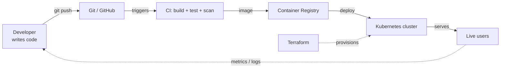
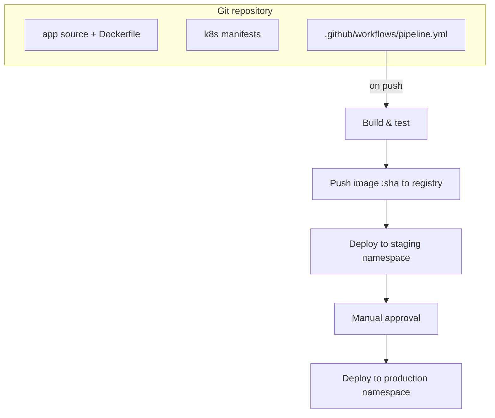

# Day 5 - End-to-End Project: One Pipeline, the Whole Course

> **Goal of today:** stop looking at the tools one at a time and wire them into a single, complete pipeline - the exact flow a real team uses to take a code change all the way to live users, automatically.

This is the capstone of the entire DevOps course. Everything you learned - Git, Terraform, Docker, Kubernetes, and the four CI/CD lessons - comes together here into one repeatable workflow.

> **Build it for real:** the [`demo/`](../demo/README.md) folder is a complete, runnable version of everything in this lesson - a Flask app with tests, a Dockerfile, Kubernetes manifests, and working GitHub Actions pipelines. Read this lesson for the concepts, then go run the demo to watch them happen.

---

## Learning Objectives

By the end of this lesson you will be able to:
- Describe the full path a commit takes from a developer's laptop to production.
- Explain where each tool from the course plugs into that path.
- Read and understand a complete, multi-stage GitHub Actions pipeline.
- Apply the safety practices (tests as a gate, secrets, approval, rollback) you learned in Days 1-4.

---

## The Big Picture (analogy)

Think of shipping a physical product. A designer finalises a blueprint (Git), a factory floor is built to make it (Terraform), the product is boxed into a standard shipping container (Docker), a fleet of trucks and warehouses moves and stocks it at scale (Kubernetes), and a fully automated conveyor belt ties every step together so a new design reaches stores with no one pushing it by hand (CI/CD).

You have built each station. Today you connect the conveyor belt.



---

## 1 How Each Tool Fits the Flow

| Stage | Tool (course module) | What happens |
|---|---|---|
| Track the change | **Git / GitHub** (Module 1) | Developer commits and opens a pull request |
| Provision infrastructure | **Terraform** (Module 2) | The cluster, network, and database are created as code, once and repeatably |
| Package the app | **Docker** (Module 3) | The app is built into an immutable image tagged with the commit SHA |
| Run it at scale | **Kubernetes** (Module 4) | The image is deployed with rolling updates, self-healing, and autoscaling |
| Automate everything | **CI/CD** (Module 5) | Every push runs tests, builds the image, and deploys - with secrets and approvals |

The key idea: **a human only writes code and reviews a pull request. Every other step is automated and identical every time.**

---

## 2 The Project We Are Building

A small web application deployed the professional way:

1. Code lives in a Git repository with branch protection (Module 1, Day 5).
2. The cluster and supporting infrastructure are defined in Terraform (Module 2, Day 9 capstone).
3. The app has a Dockerfile and is built into an image (Module 3, Days 3 and 8).
4. Kubernetes manifests (Deployment, Service, Ingress) define how it runs (Module 4).
5. A GitHub Actions pipeline ties it together (this module, Days 1-4).



---

## 3 The Complete Pipeline

This single workflow combines everything from Days 1-4: CI tests as a gate (Day 2), secrets and an approval-gated environment (Day 3), and image build plus deploy (Day 4). Read the comments - each block maps to a lesson.

```yaml
name: End-to-End Pipeline

on:
  push:
    branches: [main]
  pull_request:
    branches: [main]

env:
  REGISTRY: ghcr.io
  IMAGE_NAME: ${{ github.repository }}

jobs:
  # ---------- Stage 1: CI - the quality gate (Day 2) ----------
  test:
    name: Build and Test
    runs-on: ubuntu-latest
    steps:
      - uses: actions/checkout@v4
      - uses: actions/setup-node@v4
        with:
          node-version: "20"
          cache: "npm"
      - run: npm ci
      - run: npm test
      - run: npm run lint

  # ---------- Stage 2: Build and push the image (Day 4) ----------
  build:
    name: Build and Push Image
    runs-on: ubuntu-latest
    needs: test                      # only build if tests passed
    if: github.ref == 'refs/heads/main'
    permissions:
      contents: read
      packages: write                # least privilege (Day 3)
    steps:
      - uses: actions/checkout@v4
      - uses: docker/login-action@v3
        with:
          registry: ${{ env.REGISTRY }}
          username: ${{ github.actor }}
          password: ${{ secrets.GITHUB_TOKEN }}
      - uses: docker/build-push-action@v5
        with:
          context: .
          push: true
          tags: ${{ env.REGISTRY }}/${{ env.IMAGE_NAME }}:${{ github.sha }}

  # ---------- Stage 3: Deploy to staging (automatic) ----------
  deploy-staging:
    name: Deploy to Staging
    runs-on: ubuntu-latest
    needs: build
    environment: staging             # environment-scoped secrets (Day 3)
    steps:
      - uses: actions/checkout@v4
      - name: Set image and apply manifests
        run: |
          kubectl set image deployment/web \
            web=${{ env.REGISTRY }}/${{ env.IMAGE_NAME }}:${{ github.sha }} \
            -n staging
          kubectl rollout status deployment/web -n staging
        env:
          KUBECONFIG_DATA: ${{ secrets.KUBECONFIG_STAGING }}

  # ---------- Stage 4: Deploy to production (gated) ----------
  deploy-production:
    name: Deploy to Production
    runs-on: ubuntu-latest
    needs: deploy-staging
    environment: production          # requires manual approval (Day 3)
    steps:
      - uses: actions/checkout@v4
      - name: Deploy and verify
        run: |
          kubectl set image deployment/web \
            web=${{ env.REGISTRY }}/${{ env.IMAGE_NAME }}:${{ github.sha }} \
            -n production
          kubectl rollout status deployment/web -n production
      - name: Smoke test
        run: curl -f https://myapp.example.com/health
```

What this gives you, mapped to the course:
- A buggy commit is stopped at `test` and never builds or deploys (Day 2).
- The image is tagged with the immutable commit SHA, not `latest` (Day 4).
- The build job has only the permissions it needs (Day 3 - least privilege).
- Staging deploys automatically; production waits for a human to approve (Day 3 - environments and approval gates).
- `kubectl rollout status` ties back to Kubernetes rolling updates (Module 4, Day 6), and a failed rollout fails the pipeline.

> **Interactive demo:** open [`../animations/cicd-pipeline.html`](../animations/cicd-pipeline.html) to watch a commit flow through these exact stages, including the approval gate.

---

## 4 Where the Other Modules Plug In

- **Terraform (Module 2)** created the Kubernetes cluster, the registry, and the database this pipeline deploys into. You run Terraform *once* to build the platform; the pipeline then deploys onto it many times a day.
- **Docker (Module 3)** provides the Dockerfile this pipeline builds. A good multi-stage Dockerfile keeps the image small and secure.
- **Kubernetes (Module 4)** provides the Deployment, Service, and Ingress the pipeline updates. Rolling updates give zero-downtime deploys; if a pod is unhealthy, Kubernetes self-heals.
- **Git (Module 1)** is the trigger for everything: branch protection ensures only reviewed, tested code reaches `main`, which is what the pipeline deploys.

---

## 5 The Rollback Story

Even with all the gates, production issues happen. Your rollback options (from Day 4) all still apply here:
- Re-run the pipeline pinned to the previous good commit SHA.
- `kubectl rollout undo deployment/web -n production` to revert to the previous ReplicaSet instantly (Module 4, Day 6).
- `git revert` the bad commit and let the pipeline redeploy the corrected state.

Decide and rehearse this *before* you need it.

---

## Common Mistakes

1. **Treating the capstone as new tools.** It is not - it is the same tools you already learned, connected. If a stage confuses you, revisit that module.
2. **No branch protection on `main`.** Without it, unreviewed code reaches the pipeline and ships. The pipeline is only as safe as what is allowed onto `main`.
3. **Skipping staging.** Deploying straight to production removes your last safety net. Always promote staging to production, not laptop to production.
4. **Forgetting that Terraform and the pipeline are separate lifecycles.** Terraform builds the platform (rarely changes); the pipeline deploys the app (changes constantly). Do not rebuild the cluster on every code push.
5. **No smoke test after deploy.** A green pipeline does not guarantee a working app - verify the health endpoint before calling it done.

---

## Quick Self-Check

1. In one sentence, what is the only step in this whole flow that a human performs?
2. Which stage stops a buggy commit, and what would happen downstream if it were removed?
3. Why is the image tagged with the commit SHA instead of `latest`?
4. Which tool created the cluster the pipeline deploys into, and how often does it run compared to the pipeline?
5. Give two ways to roll back a bad production release.

---

## Summary

- This project connects every module into one automated path: commit, test, build, deploy.
- A human writes code and approves a pull request; automation does the rest, identically every time.
- The safety practices stack up: branch protection, tests as a gate, secrets, least privilege, approval gates, smoke tests, and a rehearsed rollback.
- Terraform builds the platform once; the pipeline deploys onto it continuously.

You have now completed the entire DevOps course - from the "why" of DevOps culture through Git, Terraform, Docker, Kubernetes, and CI/CD, and finally tying them all together. You can take a code change from a laptop to live users the way a professional team does.

**Back to:** [CI/CD module overview](../README.md) | [Main DevOps course](../../README.md)
