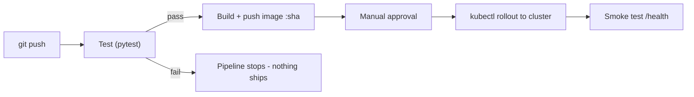

# CI/CD Demo - A Complete Working Pipeline

> A small but complete, runnable project that takes a Python web app from a code push all the way to a live deployment on Kubernetes - automatically. Use it to **demo a real pipeline to students**, or have them copy it into their own GitHub repository and watch it run.

This demo is the hands-on companion to the [CI/CD module](../README.md). The lessons explain the concepts; this folder lets you and your students *see them happen*.

---

## What this demo proves

When a developer pushes a change:
1. **CI runs the tests.** If a test fails, the pipeline goes red and the change is blocked. (Day 2)
2. **A Docker image is built and pushed**, tagged with the exact commit SHA. (Day 4)
3. **The image is deployed to Kubernetes** with a zero-downtime rolling update, behind an approval gate. (Days 3 and 5)
4. **A smoke test confirms** the new version actually responds. (Day 4)



---

## What is in this folder

```
demo/
  app/main.py                  the Flask web app (home page + /health)
  tests/test_app.py            pytest tests (CI runs these)
  requirements.txt             Python dependencies
  Dockerfile                   multi-stage build, non-root runtime
  .dockerignore
  k8s/
    deployment.yaml            the Deployment the pipeline updates
    service.yaml               exposes the app and load-balances pods
  .github/workflows/
    ci.yml                     test + lint on every push/PR
    cicd.yml                   test -> build -> push -> deploy to Kubernetes
  README.md                    this file
```

> **Important about the workflows:** GitHub only runs workflow files that live at the **repository root** in `.github/workflows/`. The copies here under `demo/.github/workflows/` are for reading and teaching. To actually run them, copy the `demo/` contents to the root of a new repository (see "Run it for real" below).

---

## Part 1 - Run the app locally (no pipeline yet)

This shows students the plain app before any automation.

```bash
cd demo
python -m venv venv
# Windows:        venv\Scripts\activate
# Mac/Linux:      source venv/bin/activate
pip install -r requirements.txt

# run the tests (this is exactly what CI will run)
pytest -v

# run the app
python app/main.py
# open http://localhost:5000  and  http://localhost:5000/health
```

Teaching point: the tests and the app are ordinary code. CI/CD does not change *what* runs - it just runs it automatically, every time, for everyone.

---

## Part 2 - Build and run the container

Ties back to the Docker module.

```bash
docker build -t cicd-demo:local .
docker run -d -p 5000:5000 -e APP_VERSION=local cicd-demo:local
# open http://localhost:5000  - notice the version says "local"
```

Teaching point: the same image will run identically in the pipeline and on the cluster - this is why we containerise.

---

## Part 3 - Run the full pipeline for real

This is the live demo. You need a GitHub account and a Kubernetes cluster.

### Step 1 - Create a repo from this demo
1. Create a new GitHub repository.
2. Copy everything inside `demo/` to the root of that repository, so the structure becomes:
   ```
   <repo-root>/app/  tests/  Dockerfile  requirements.txt  k8s/  .github/workflows/
   ```
3. Commit and push to `main`.

### Step 2 - First, see CI run
The `ci.yml` workflow runs immediately on push. Open the repository's **Actions** tab and watch the Lint and Test job. Then, to demonstrate the gate:
- Break a test on purpose (change an assertion in `tests/test_app.py`), push, and watch the run go **red**. Nothing downstream happens.
- Fix it, push, and watch it go **green**.

### Step 3 - Prepare the Kubernetes cluster (one time)
Apply the manifests so the Deployment exists for the pipeline to update:
```bash
# edit k8s/deployment.yaml: replace ghcr.io/OWNER/REPO with your image path
kubectl apply -f k8s/
kubectl get pods        # two cicd-demo pods should appear
```

### Step 4 - Give the pipeline access to the cluster
The `cicd.yml` workflow needs a kubeconfig and an approval environment:
1. Base64-encode your kubeconfig and add it as a repository secret named `KUBE_CONFIG`:
   ```bash
   # Mac/Linux:
   base64 -w0 ~/.kube/config
   # copy the output into GitHub: Settings -> Secrets and variables -> Actions -> New repository secret
   ```
2. Create an environment named `production` (Settings -> Environments) and add yourself as a **required reviewer**. This is the approval gate from Day 3.

### Step 5 - Trigger the full deploy
Push any change to `main`. In the Actions tab watch:
1. **Test** runs and passes.
2. **Build and Push Image** publishes `ghcr.io/you/repo:<sha>`.
3. **Deploy** waits for your approval, then rolls the new image onto the cluster and smoke-tests `/health`.

Open the app (on Minikube: `minikube service cicd-demo`) and confirm the displayed version now matches the latest commit SHA - proof the pipeline really shipped your change.

---

## Part 4 - Demonstrate a rollback

Show students that mistakes are recoverable (Day 4):
```bash
kubectl rollout undo deployment/cicd-demo   # instantly back to the previous version
kubectl rollout status deployment/cicd-demo
```

---

## Suggested 30-minute class demo flow

1. Show the app and tests running locally (Part 1) - 5 min.
2. Push a green commit; watch CI pass in the Actions tab (Part 3, Step 2) - 5 min.
3. Break a test; push; watch CI block it; fix it - 7 min.
4. Push to main; approve the gate; watch it deploy to Kubernetes (Part 3, Step 5) - 8 min.
5. Roll back (Part 4) - 5 min.

---

## Common Mistakes

1. **Putting the workflows in a subfolder.** GitHub only runs `.github/workflows/` at the repository root. The `demo/.github/` copies here are for reading.
2. **No cluster reachable from GitHub.** A local Minikube on your laptop is not reachable from GitHub's hosted runners. For a live cloud deploy, use a cloud cluster (EKS/GKE/AKS), or run the deploy step from a self-hosted runner, or just demo the build-and-push stages and run the `kubectl` deploy by hand against Minikube.
3. **Forgetting to create the Deployment first.** `kubectl set image` updates an existing Deployment; apply `k8s/` once before the pipeline runs.
4. **Committing the kubeconfig.** Never commit it - it goes in the `KUBE_CONFIG` secret only.

---

## How this demo maps to the lessons

| Demo piece | Lesson |
|---|---|
| `tests/` running as a gate | [Day 2 - Continuous Integration](../day2-continuous-integration/notes.md) |
| `KUBE_CONFIG` secret + `production` approval | [Day 3 - Secrets & Environments](../day3-secrets-environments/notes.md) |
| Build, push SHA-tagged image, smoke test, rollback | [Day 4 - Continuous Deployment](../day4-continuous-deployment/notes.md) |
| The whole flow tied together | [Day 5 - End-to-End Project](../day5-end-to-end-project/notes.md) |
| `Dockerfile` multi-stage, non-root | [Docker module](../../learn-docker) |
| `k8s/` Deployment, Service, probes | [Kubernetes module](../../learn-k8s) |

Back to the [CI/CD module overview](../README.md).
