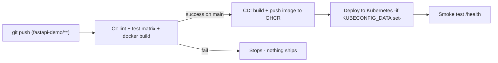

# FastAPI CI/CD Demo - One App, Real Pipelines

> A small **FastAPI** app that goes from a `git push` all the way to a container image (and a Kubernetes deploy) - **automatically**, with real GitHub Actions workflows. Built to demo a genuine CI/CD pipeline in class.

The whole module uses **this one app**: CI (Day 2) tests and builds it; CD (Day 4/5) ships it. One app, two pipelines.

---

## What is in here

```
fastapi-demo/
├── app/
│   ├── main.py            # FastAPI app: GET / and GET /health
│   └── __init__.py
├── tests/test_main.py     # pytest tests (what CI runs)
├── requirements.txt       # pinned dependencies
├── pytest.ini  .flake8    # test + lint config
├── Dockerfile             # multi-stage, non-root (what CD builds)
├── k8s/                   # deployment + service (CD target)
├── ci/                    # CI lesson notes + a teaching copy of ci.yml
└── cd/                    # CD lesson notes + a teaching copy of cd.yml
```

The **workflows that actually run** live at the repository root (GitHub only runs workflows from `<repo-root>/.github/workflows/`):

```
<repo root>/.github/workflows/
├── ci.yml    # CI (fastapi-demo) - runs on push/PR touching fastapi-demo/**
└── cd.yml    # CD (fastapi-demo) - runs AFTER CI succeeds on main
```

> **Monorepo pattern:** the workflows are **path-filtered to `fastapi-demo/**`**, so editing a note elsewhere in the repo does not trigger them - only changes to this demo do. This is exactly how real teams run per-service pipelines in a shared repo.

---

## The end-to-end flow



- **CI** ([ci/README.md](ci/README.md)) runs on every push/PR: lint, tests on Python 3.11 and 3.12, and a Docker build. It is the quality gate.
- **CD** ([cd/README.md](cd/README.md)) runs only after CI passes on `main`: it builds and pushes the image to GHCR, then deploys to Kubernetes **if** you have added a `KUBECONFIG_DATA` secret.

---

## Run it locally first (sanity check)

```bash
cd fastapi-demo
python -m venv .venv && source .venv/bin/activate    # Windows: .venv\Scripts\activate
pip install -r requirements.txt

pytest -v                                            # the tests CI runs
uvicorn app.main:app --reload                        # then open http://127.0.0.1:8000/health

docker build -t fastapi-demo .                       # the image CD builds
docker run -p 8000:8000 fastapi-demo                 # open http://localhost:8000
```

---

## Run it as a class demo (the real thing)

1. This repo already has the workflows wired up. Push any change under `fastapi-demo/` (or use the "break a test" demo in [ci/README.md](ci/README.md)).
2. Open the repo's **Actions** tab and watch **CI (fastapi-demo)** run live.
3. When CI passes on `main`, **CD (fastapi-demo)** runs and pushes the image to GHCR.
4. To make CD deploy to a real cluster, add the `KUBECONFIG_DATA` secret - see [cd/README.md](cd/README.md).

---

**Part of:** [CI/CD module](../README.md) - [Day 2 CI](../day2-continuous-integration/notes.md) - [Day 4 CD](../day4-continuous-deployment/notes.md)
