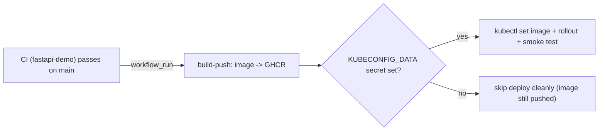

# CD - Ship the Verified Artifact (notes)

> **What CD does here:** once CI passes on `main`, it **builds and pushes the image to GHCR** (live, out of the box), then **deploys to Kubernetes** if you have configured a kubeconfig. Concepts from [Day 4](../../day4-continuous-deployment/notes.md) and [Day 5](../../day5-end-to-end-project/notes.md), running for real.

> **Detailed concept reference:** for **every CD feature** used here - `workflow_run` gating, image build/push, registries + tagging, secrets, permissions + OIDC, environments + approval gates, Kubernetes deploy, deployment strategies, smoke tests, rollback, concurrency - explained clearly and mapped to our real `cd.yml`, see **[concepts.md](concepts.md)**.

The workflow is [`cd.yml`](cd.yml) in this folder (a teaching copy). The one that actually runs is the identical file at the repo root: `.github/workflows/cd.yml`.

---

## CI gates CD (the important pattern)

CI and CD are **separate** workflows. CD does not run on push - it runs **after CI succeeds** on `main`, using the `workflow_run` trigger:

```yaml
on:
  workflow_run:
    workflows: ["CI (fastapi-demo)"]
    types: [completed]
    branches: [main]
jobs:
  build-push:
    if: ${{ github.event.workflow_run.conclusion == 'success' }}   # only if CI passed
```

This enforces the rule from Day 2: **only a CI-verified commit is ever deployed.** CD then checks out `github.event.workflow_run.head_sha` - the exact commit CI tested.



---

## Part 1: Build and push the image (works out of the box)

The `build-push` job needs no setup - it uses the built-in `GITHUB_TOKEN` (with `packages: write`) to push to **GHCR**:

```
ghcr.io/<owner>/<repo>/fastapi-demo:<commit-sha>
ghcr.io/<owner>/<repo>/fastapi-demo:latest
```

After a successful CD run, the image appears under the repo's **Packages**. This is the CI/CD "artifact" - the tested, versioned thing CD produces.

---

## Part 2: Deploy to Kubernetes (turn it on with one secret)

The `deploy` job is fully written but **skips cleanly until you add a kubeconfig**, so CD is green (image pushed) even before you wire up a cluster. To enable the live rollout:

1. **Base64-encode your kubeconfig** (any cluster: minikube, EKS, GKE...):
   ```bash
   base64 -w0 ~/.kube/config          # macOS: base64 -i ~/.kube/config
   ```
2. **Add it as a repository secret** named `KUBECONFIG_DATA`:
   `Settings -> Secrets and variables -> Actions -> New repository secret`.
3. *(Optional)* Add a repository **variable** `K8S_NAMESPACE` (defaults to `default`).
4. **Apply the manifests once** so the Deployment exists for CD to update:
   ```bash
   kubectl apply -f fastapi-demo/k8s/
   ```

On the next CD run, the deploy job decodes the secret, points `KUBECONFIG` at it, and does a rolling update:

```yaml
- run: |
    echo "$KUBECONFIG_DATA" | base64 -d > "$RUNNER_TEMP/kubeconfig"
    echo "KUBECONFIG=$RUNNER_TEMP/kubeconfig" >> "$GITHUB_ENV"
- run: |
    kubectl set image deployment/fastapi-demo fastapi-demo="$IMAGE" -n "$NS"
    kubectl rollout status deployment/fastapi-demo -n "$NS"
```

> **Note (generic on purpose):** this uses a kubeconfig secret so it works on **any** cluster. For a production EKS setup you would instead use **OIDC** (`aws-actions/configure-aws-credentials`) + `aws eks update-kubeconfig` + an EKS **access entry** - no long-lived kubeconfig in a secret. That is the [Day 3 OIDC](../../day3-secrets-environments/notes.md) and [Day 5](../../day5-end-to-end-project/notes.md) upgrade.

---

## Rollback

If a deploy goes bad, the same tools from Day 4 apply:

```bash
kubectl rollout undo deployment/fastapi-demo -n <namespace>   # instant, previous ReplicaSet
```

Or re-run CD pinned to the previous good commit SHA (the image tag), or `git revert` and let the pipeline redeploy the corrected state.

---

Back to the [demo overview](../README.md) - [CI notes](../ci/README.md).
