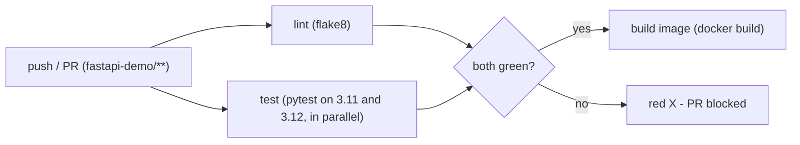

# CI - The Quality Gate (notes)

> **What CI does here:** on every push and pull request that touches `fastapi-demo/`, it **lints**, **tests** (on two Python versions), and **builds the image** - and blocks the change if any of that fails. Concepts from [Day 2](../../day2-continuous-integration/notes.md), running for real.

The workflow is [`ci.yml`](ci.yml) in this folder (a teaching copy). The one that actually runs is the identical file at the repo root: `.github/workflows/ci.yml`.

---

## The three jobs



| Job | What it proves | Key steps |
|-----|----------------|-----------|
| **lint** | Code is clean, no undefined names | `flake8 app tests` |
| **test** | The app behaves (on 3.11 **and** 3.12) | `pip install -r requirements.txt` then `pytest -v` |
| **build** | It actually containerises | `docker build` - runs only if lint + test pass (`needs:`) |

Two details worth pointing out in class:
- **`matrix` + `fail-fast: false`** runs the tests on both Python versions in parallel and reports failures on both, not just the first.
- **`cache: pip`** restores dependencies in seconds on repeat runs; `cache-dependency-path` points it at `fastapi-demo/requirements.txt` because the workflow lives at the repo root.

---

## Run the demo: watch CI block a broken change

This is the moment CI clicks - you *see* it stop bad code.

1. **Push and watch it pass.** Make any trivial change under `fastapi-demo/` and push. Open **Actions -> CI (fastapi-demo)** and watch `lint`, `test (3.11)`, `test (3.12)`, and `build` go green.

2. **Break a test on purpose.** In [`../app/main.py`](../app/main.py), make `/health` return the wrong status:
   ```python
   @app.get("/health")
   def health():
       return {"status": "broken", "version": APP_VERSION}   # test expects "ok"
   ```
   Commit on a branch and open a PR:
   ```bash
   git checkout -b break-it
   git commit -am "Break the health check"
   git push origin break-it
   ```

3. **Watch CI go red.** `test_health_returns_ok` fails; the PR shows a red X with the exact failure. CI just caught the break before it reached `main`.

4. **Make the gate real.** Turn on branch protection for `main` (Settings -> Branches -> require the `test` and `lint` checks). Now the red PR shows **"Merging is blocked"** - the button is disabled.

5. **Fix it, go green.** Revert to `status="ok"`, push, watch CI turn green, and the Merge button unlocks.

**What you proved:** with CI + branch protection, the only code that reaches `main` is code that lint-passed and tested green. That guarantee is the whole point of Continuous Integration.

---

## Local equivalent (what CI runs, on your machine)

```bash
cd fastapi-demo
pip install -r requirements.txt flake8
flake8 app tests
pytest -v
docker build -t fastapi-demo .
```

Next: once CI is green on `main`, [CD](../cd/README.md) takes over and ships the image.
